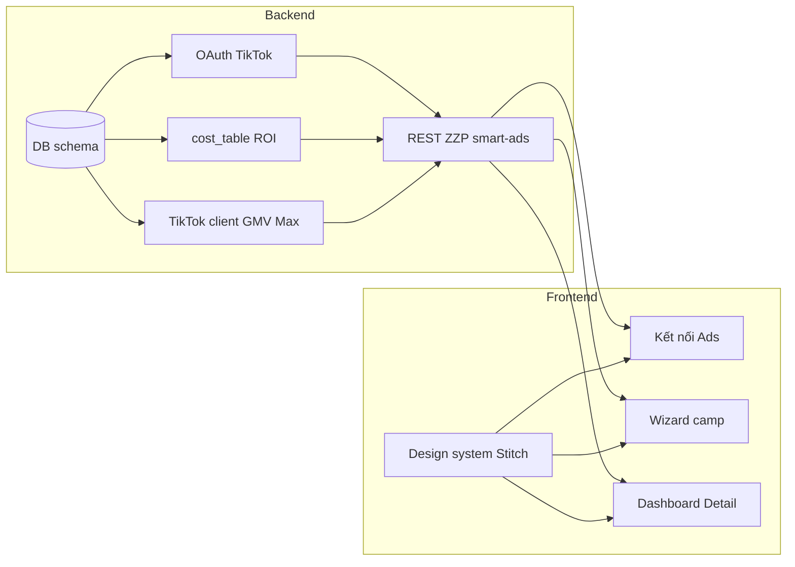

# Chia task Phase 1 Smart Ads (FE / BE)

## Phạm vi Phase 1 (theo tài liệu)

Theo [docs/PRD-SmartAds-v2.md](docs/PRD-SmartAds-v2.md) **Phase 1 — Nền tảng (TikTok Parity):** OAuth TikTok Ads, bảng chi phí + gợi ý ROI, tạo GMV Max (tất cả sản phẩm + video KOC), dashboard hiệu suất trong ZZP, ngân sách khởi tạo an toàn (**20% MDB** theo [docs/SRS-Campaign-Engine.md](docs/SRS-Campaign-Engine.md) — tạo camp).

**Lưu ý cần làm rõ với PM/Tech lead:** [docs/SRS-Campaign-Engine.md](docs/SRS-Campaign-Engine.md) mô tả tạo campaign với `roas_bid` + `ALL_PRODUCTS` / `ALL_VIDEOS`, trong khi [docs/SmartAds-RunAllVideos-Flow.md](docs/SmartAds-RunAllVideos-Flow.md) mô tả **Max Delivery 72h** rồi mới Target ROI và công thức **Budget_initial** khác (40% nếu MDB &lt; 2M). Backlog bên dưới giữ payload có thể cấu hình; khi implement TikTok `POST /campaign/gmv_max/create/` cần **một** quyết định thiết kế thống nhất.

**Ngoài Phase 1 (tối ưu tự động trong PRD — Phase 2):** tự động tối ưu hàng ngày, Hero, chặn bùng đơn, tồn kho… — chỉ nên là **stub DB/state** hoặc **ghi chú future** nếu UI/dashboard cần hiển thị trạng thái, tránh scope creep.

---

## Campaign do Seller tạo trên TikTok — sync hay clone? Lưu DB thế nào để ZZP không được edit?

**Căn cứ:** PRD [docs/PRD-SmartAds-v2.md](docs/PRD-SmartAds-v2.md) **BR-2** — ZZP không được sửa/tắt các chiến dịch Seller đã tự tạo trên TikTok; ZZP chỉ quản lý camp do ZZP tạo.

### Khuyến nghị: **chỉ sync (mirror/cache), không “clone” sang TikTok**

| Khái niệm | Ý nghĩa | Khuyến nghị Phase 1 |
|-----------|---------|----------------------|
| **Sync** | Định kỳ hoặc on-demand gọi TikTok **GET** danh sách/chi tiết GMV Max, lưu **bản sao chỉ đọc** trong DB ZZP (hoặc cùng bảng với cờ nguồn). Không tạo thêm entity quảng cáo mới trên TikTok. | **Nên làm** — đúng BR-2, hiển thị trong dashboard “toàn cảnh”, phân tách với camp ZZP. |
| **Clone (tạo camp mới trên TikTok)** | `POST /campaign/gmv_max/create/` thêm một camp mới copy cấu hình. | **Không** dùng cho mục tiêu “import camp seller” — dễ trùng chi phí, trùng mục tiêu, vi phạm tinh thần BR-2 (Seller không chủ động tạo camp đó trên TikTok). |
| **Clone chỉ trong DB** | Copy snapshot vào DB để báo cáo/offline. | Về bản chất vẫn là **sync**; gọi tên “denormalized mirror” cho rõ. |

### Lưu trữ & enforce “không edit từ ZZP”

1. **Một nguồn sự thật trên TikTok** — mọi chỉnh sửa camp seller chỉ xảy ra trên TikTok Ads Manager (hoặc app TikTok), không qua API write của ZZP.
2. **DB:** thêm trường phân loại trên `campaign_state` (hoặc bảng `campaign_mirror` nếu muốn tách sạch):
   - `ownership` = `ZZP_MANAGED` \| `EXTERNAL_TIKTOK` (hoặc `created_by: zzp \| seller`)
   - `zzp_mutable` = `true` chỉ khi `ZZP_MANAGED`
   - `tiktok_campaign_id` (unique theo advertiser), `last_synced_at`, optional `raw_payload` JSON để debug
3. **Chiến lược nhận diện camp ZZP vs seller:** khi ZZP tạo camp, đặt `campaign_name` theo quy ước tài liệu (vd. prefix `ZZP-SmartAds-`) **và** lưu `tiktok_campaign_id` ngay sau create — mọi row `ZZP_MANAGED` phải khớp id đó. Các campaign GET được từ TikTok **không** nằm trong tập id ZZP → ingest làm `EXTERNAL_TIKTOK`. (Nếu sau này TikTok có field “app/source” chính thức thì có thể bổ sung; convention tên là lớp an toàn thêm.)
4. **API BE:** mọi handler `PUT/POST .../campaigns/{id}`, `.../status`, `.../creatives` **từ chối 403** nếu `ownership != ZZP_MANAGED`. Unit test bắt buộc cho nhánh này.
5. **Optimization / job tương lai:** job chỉ load `ZZP_MANAGED`; **không** enqueue action cho `EXTERNAL_TIKTOK`.

### FE (Phase 1)

- Danh sách & chi tiết: badge **“Tạo trên TikTok — chỉ xem”**; ẩn hoặc disable nút Sửa / Tạm dừng / Gắn video / Bắt đầu chạy… khi `zzp_mutable === false`.
- Có thể vẫn cho **xem báo cáo** (read-only reports) nếu PM muốn “parity xem hiệu suất toàn shop” — chỉ cần BE expose reports theo `campaign_id` và không kèm mutation.

---

## Có nên chia theo Story không?

**Nên.** Cách làm thực dụng:

- **Epic:** một “mảng giá trị” lớn (ví dụ *Smart Ads — Onboarding*, *Smart Ads — Chiến dịch & Báo cáo*).
- **Story:** một luồng người dùng nghiệm thu được (vd. onboarding + “Bắt đầu chạy” + dashboard) — thường **cắt dọc (vertical slice)**: BE API + FE màn hình + tích hợp.
- **Task:** ticket nhỏ cho dev (schema migration, client TikTok, component, test thủ công API…).

Lợi ích: Story là đơn vị demo cho stakeholder; Task là đơn vị assign trong sprint. Tránh chỉ chia “theo layer” (hết BE rồi mới FE) vì dễ tắc nghẽn tích hợp muộn.

---

## Ánh xạ màn Stitch → luồng sản phẩm

Thư mục: [temp-ui/stitch_zzp_gmv_max_optimizer](temp-ui/stitch_zzp_gmv_max_optimizer) + tokens [emerald_data_system/DESIGN.md](temp-ui/stitch_zzp_gmv_max_optimizer/emerald_data_system/DESIGN.md).

| Màn (Stitch) | Vai trò trong journey |
|--------------|------------------------|
| `c_u_h_nh_chi_n_d_ch_gmv_max_popup_xem_tr_c_hi_u_ng_h_n_ch` — *Thiết lập chiến dịch GMV Max* | Wizard: MDB, ROI, preview — gọi API gợi ý / validate |
| `gmv_max_x_c_nh_n_l_i_s_d_l_u_nh_p` | Bước xác nhận số dư / cảnh báo nạp tiền TikTok (BR-1) |
| `gmv_max_x_c_nh_n_kh_i_t_o` | Xác nhận khởi tạo trước khi tạo campaign |
| `gmv_max_dashboard_qu_n_l_chi_n_d_ch_chi_ti_t` | Danh sách / tổng quan chiến dịch |
| `chi_ti_t_chi_n_d_ch_gmv_max_bi_u_c_t_danh_s_ch_s_n_ph_m` | Chi tiết camp: biểu đồ, sản phẩm, chỉ số |

Luồng kỹ thuật OAuth không có file Stitch riêng — thường là **CTA + redirect + callback** trên entry Smart Ads Center.

API TikTok tổng hợp: [docs/API-tik-tok.md](docs/API-tik-tok.md) — map sang REST nội bộ dạng `/api/v1/smart-ads/...` và `/tiktok-business/gmv-max/...` như tài liệu dự án.

---

## Sơ đồ phụ thuộc (rút gọn)

---

## Backlog đề xuất — Backend

Mỗi mục: **ID**, **Title**, **Description**, **Acceptance**, **Phụ thuộc**. **Một danh sách duy nhất** từ **P1-BE-01 → P1-BE-23** (đã gộp phần “bổ sung” trước đây). Chi tiết kỹ thuật ghi trực tiếp dưới đây. **Thứ tự số chỉ để tra cứu;** thứ tự triển khai theo **Phụ thuộc** (vd. **21** trước khi wire đầy đủ **12**).

**Tham chiếu nhanh (yêu cầu mở rộng 1–13 → ID):** (1) scope → **15**; (2) refresh hết hạn → **05**; (3) DB + sync + cờ ZZP → **03**, **13**; (4) config 1-1 → **16**; (5) API tạo + tiền + TikTok + idempotent + tên `ZZP` → **09**; (6) audit nội bộ → **17**; (7) nháp → **18**; (8) sửa camp ZZP → **19**; (9) eligibility “tất cả SP” → **20**; (10) list product proxy → **07**; (11) bảng lỗi TikTok → **21** + **12**; (12) notification → **22**; (13) lưu notification/seller → **23**.

- **P1-BE-01 — Database: oauth_tokens + migration**
  - **Description:** Bảng lưu kết nối TikTok Ads per seller: `seller_id`, `advertiser_id`, `access_token` và `refresh_token` **mã hóa** (AES-256), `expires_at` (hết hạn access), `refresh_exp_at` (hết hạn refresh), `status` enum `ACTIVE` | `EXPIRED` | `REVOKED`.
  - **Acceptance:** Migration chạy được; log/APM không chứa token plaintext.
  - **Phụ thuộc:** —

- **P1-BE-02 — Database: cost_table (+ shop/product FK nếu codebase có convention)**
  - **Description:** Một dòng / một `product_id` (TikTok Shop): `gia_ban` (P, VND), `cogs`, `phi_san_pct`, `phi_thanh_toan_pct`, `hoa_hong_koc_pct`, `phi_ship_seller`, `phi_dong_goi` — đồng bộ từ TikTok Shop (giá) + dịch vụ nội bộ ZZP (COGS, phí). Dùng để tính **ROAS hòa vốn**: `CM = P - cogs - P*(phi_san_pct + phi_thanh_toan_pct + hoa_hong_koc_pct) - phi_ship_seller - phi_dong_goi`; `ROAS_be = P / CM` (khi CM &gt; 0).
  - **Acceptance:** Có dữ liệu tối thiểu để API `roi-suggestion` trả đúng `ROAS_be` với ví dụ kiểm chứng trong tài liệu dự án.
  - **Phụ thuộc:** P1-BE-01 (không bắt buộc), có thể song song.

- **P1-BE-03 — Database: campaign_state**
  - **Description:** Bảng trạng thái chiến dịch ZZP/TikTok: `id` (uuid **id nội bộ ZZP**), `seller_id`, `advertiser_id`, **`tiktok_campaign_id` nullable** (null = nháp chưa publish lên TikTok), `state` enum `INIT` | `WARMING` | `STABLE` | `HERO` | `PAUSED`, `campaign_type` `MAIN` | `HERO` | `REVIVAL`, `parent_campaign_id` (nullable), `roi_target`, `daily_budget`, `max_daily_budget` (MDB), `activated_at`, `warming_ends_at` (= `activated_at` + 72h), `last_optimized_at`, `last_optimized_date`, `paused_at`, `paused_reason` (vd. `OUT_OF_STOCK` | `PAYMENT_FAILED` | `CANCEL_RATE` | `MANUAL` | `BUDGET_CAP`). **Thêm:** `ownership` (`ZZP_MANAGED` | `EXTERNAL_TIKTOK`), `zzp_mutable` (boolean), `last_synced_at`, tùy chọn `raw_payload` JSON — xem mục *Campaign do Seller tạo*. **Đồng bộ định kỳ:** job (vd. mỗi 15–60 phút + sau mỗi lần seller mở dashboard) gọi TikTok list/get, upsert: TikTok là source of truth cho trường mirror; ZZP chỉ ghi đè các cột “smart” qua bảng config (task P1-BE-16).
  - **Acceptance:** Một seller có N camp; unique `(advertiser_id, tiktok_campaign_id)` **khi `tiktok_campaign_id` không null**; mọi dòng `EXTERNAL_TIKTOK` có `zzp_mutable=false`; nháp ZZP có `tiktok_campaign_id` null + `ownership=ZZP_MANAGED`.
  - **Phụ thuộc:** P1-BE-01.

- **P1-BE-04 — OAuth TikTok: connect URL + callback exchange**
  - **Description:** `GET /api/v1/smart-ads/oauth/connect?seller_id=…` trả URL TikTok `https://business-api.tiktok.com/portal/auth?app_id=…&redirect_uri=…&state=…` với **đủ scope** Smart Ads cần (tối thiểu theo tài liệu dự án: quản lý advertiser, campaign, báo cáo GMV Max, onsite commerce store, audience nếu Phase sau dùng). `GET …/oauth/callback?code=…&state=…`: verify `state`, exchange `code` → access + refresh token, gọi TikTok lấy `advertiser_id` + tên tài khoản, lưu DB mã hóa.
  - **Acceptance:** Luồng đầy cuối: sau callback có token trong DB, `status=ACTIVE`, `advertiser_id` khớp TikTok; CSRF qua `state`.
  - **Phụ thuộc:** P1-BE-01.

- **P1-BE-05 — OAuth: status + disconnect + refresh job (flow hết hạn)**
  - **Description:** `GET /api/v1/smart-ads/oauth/status?seller_id=…` → `{ connected, advertiser_id, account_name, expires_at }`. `DELETE …/oauth/disconnect` → xóa token / vô hiệu hóa. **Refresh chủ động:** job (hoặc scheduler) refresh access token trước khi hết hạn ~**5 phút**. **Refresh thụ động / khi seller “hết hạn”:** mọi client TikTok gặp **401** do token hết hạn → thử refresh **một lần** rồi retry request; refresh fail → `status=EXPIRED`, trả lỗi rõ cho FE (banner “kết nối lại TikTok”). **Lưu ý:** refresh_token cũng có thể hết hạn — khi đó bắt buộc OAuth lại.
  - **Acceptance:** Disconnect xóa quyền dùng API; token hết hạn xử lý đúng nhánh `EXPIRED`; có ít nhất một integration test hoặc script chứng minh refresh + retry.
  - **Phụ thuộc:** P1-BE-04.

- **P1-BE-06 — Internal API: cost-table + roi-suggestion**
  - **Description:** `GET /api/v1/smart-ads/cost-table?shop_id=…` (danh sách), `GET …/cost-table/{product_id}` (chi tiết), `GET …/roi-suggestion?product_id=…` → `{ product_id, roas_breakeven, cm_per_order, suggested_roi_target }` (công thức ROAS_be/CM như task P1-BE-02).
  - **Acceptance:** Response có đủ field để FE wizard hiển thị gợi ý; giá trị `ROAS_be` khớp công thức với fixture test.
  - **Phụ thuộc:** P1-BE-02.

- **P1-BE-07 — TikTok client: store products (ZZP chỉ làm trung gian)**
  - **Description:** Gọi TikTok `GET /store/product/get/` → expose nội bộ `GET /api/v1/smart-ads/products` (phân trang/filter theo contract TikTok). BE **không** tự biến đổi danh sách sản phẩm ngoài map field chuẩn hóa response.
  - **Acceptance:** Xử lý rate limit HTTP **429** (exponential backoff); lỗi mạng/5xx: retry tối đa **3** lần, backoff **1s → 5s → 15s**, sau đó log + alert nội bộ; lỗi từ TikTok ghi vào bảng task P1-BE-21 khi áp dụng.
  - **Phụ thuộc:** P1-BE-05.

- **P1-BE-08 — TikTok client: GMV Max videos + (tuỳ chọn P1) creatives**
  - **Description:** Gọi TikTok `GET /gmv_max/video/get/`; nếu UI cần pool: `GET /smart-ads/videos`.
  - **Acceptance:** Trả danh sách video khả dụng cho advertiser đã OAuth; cùng chính sách retry/backoff như client TikTok chung.
  - **Phụ thuộc:** P1-BE-05.

- **P1-BE-09 — API tạo chiến dịch Smart Ads (publish lên TikTok, idempotent)**
  - **Description:** `POST /api/v1/smart-ads/campaigns` (hoặc `…/campaigns/publish` nếu tách với nháp) nhận body: MDB, cấu hình sản phẩm/video (theo Phase 1 đã chốt), `idempotency-key` header (hoặc body). **Thứ tự xử lý gợi ý:** (1) Kiểm tra OAuth **ACTIVE** + **scope đủ** (P1-BE-15). (2) **Kiểm tra số dư / khả năng chi tiêu** tài khoản quảng cáo: gọi đúng **TikTok Advertiser/Billing API** mà app được phép (xem doc TikTok + quyền app); nếu API không khả dụng trong P1 thì **soft-check**: cảnh báo + cho tạo nhưng log rủi ro — cần PM chốt. (3) Gọi TikTok `POST /campaign/gmv_max/create/` với `budget` = **20%** MDB, `roas_bid` = **ROAS_be**, `budget_mode=BUDGET_MODE_DAY`, `promotion_type=PRODUCT_SALE`, nguồn SP/video theo spec; **`campaign_name` luôn bắt đầu bằng `ZZP`** (vd. `ZZP-SmartAds-{shop}-{YYYYMMDD}`). (4) Lưu `campaign_state`: gán `tiktok_campaign_id`, `state=WARMING`, `activated_at`, `warming_ends_at=+72h`, `ownership=ZZP_MANAGED`, `zzp_mutable=true`. (5) Upsert **một dòng** `smart_ads_campaign_config` (P1-BE-16) khóa 1-1 theo `id` ZZP. (6) Ghi **audit log** (P1-BE-17): khởi tạo, tham số chi phí/ROI/budget đã gửi TikTok.
  - **Acceptance:** Ngân sách ngày trên TikTok = 20% MDB; `roas_bid` = ROAS_be; tên camp bắt đầu `ZZP`; retry/idempotency **không** tạo duplicate (unique theo seller + `idempotency-key` và/hoặc kiểm tra đã có `tiktok_campaign_id` cho cùng bản ghi publish).
  - **Phụ thuộc:** P1-BE-03, P1-BE-05, P1-BE-06, P1-BE-15, P1-BE-16, P1-BE-17.

- **P1-BE-10 — Đọc campaign: list + detail + status**
  - **Description:** Proxy TikTok `GET` list/info; merge `campaign_state` trả `ownership`, `zzp_mutable`. `POST …/campaigns/{id}/status` (pause/resume/delete) **chỉ** khi `ZZP_MANAGED` (BR-2 PRD).
  - **Acceptance:** List gồm camp ZZP + camp seller đã sync; detail đúng cờ; mọi mutation trên `EXTERNAL_TIKTOK` → **403**.
  - **Phụ thuộc:** P1-BE-09, P1-BE-13.

- **P1-BE-11 — Báo cáo GMV Max**
  - **Description:** Gọi TikTok `GET /gmv_max/report/get/` → nội bộ `GET /smart-ads/reports` với dimensions (vd. `campaign_id`, `stat_time_day`, `item_group_id`, `item_id`…). Metrics cho dashboard: **`gross_revenue`** (GMV), **`cost`**, **`roi`** (= gross_revenue/cost, blended TikTok), **`orders`**, có thể suy `cost/orders`.
  - **Acceptance:** FE có đủ chuỗi thời gian + tổng để vẽ chart/bảng như màn chi tiết.
  - **Phụ thuộc:** P1-BE-10.

- **P1-BE-12 — Nhật ký lỗi TikTok + health (ứng dụng)**
  - **Description:** Log có cấu trúc (stdout/APM), không token; metric/alert khi hết retry. Client TikTok: backoff **429**, retry **3** lần **1s / 5s / 15s**. **Bổ sung:** mọi lỗi TikTok đủ điều kiện (HTTP code, `request_id` TikTok nếu có, endpoint, `seller_id`/`advertiser_id`) **persist** sang bảng **P1-BE-21** để vận hành ZZP tra cứu tập trung.
  - **Acceptance:** Mỗi request có trace id; throttle/5xx quan sát được; ít nhất một đường ghi DB lỗi TikTok cho team nội bộ.
  - **Phụ thuộc:** P1-BE-21 (cùng triển khai hoặc P1-BE-21 trước schema).

- **P1-BE-13 — Ingest / sync campaign từ TikTok (seller + ZZP, cờ ZZP hay không)**
  - **Description:** Job định kỳ + `POST …/campaigns/sync` (on-demand) + chạy sau OAuth lần đầu: `GET /gmv_max/campaign/get/` (+ `campaign/gmv_max/info/` khi cần), **upsert** `campaign_state` theo `tiktok_campaign_id`. **Phân loại:** `ZZP_MANAGED` nếu id khớp bản ghi ZZP đã tạo **hoặc** `campaign_name` bắt đầu `ZZP` (theo quy ước đã chốt); ngược lại `EXTERNAL_TIKTOK`, `zzp_mutable=false`, **không** tạo dòng `smart_ads_campaign_config`. Đồng bộ ghi `last_synced_at`; có thể lưu diff nhỏ vào audit nếu cần (tuỳ PM).
  - **Acceptance:** DB phản ánh trạng thái TikTok sau mỗi lần sync; không TikTok **write** cho `EXTERNAL_TIKTOK`.
  - **Phụ thuộc:** P1-BE-03, P1-BE-05.

- **P1-BE-14 — Guard mutation (middleware / domain service)**
  - **Description:** Lớp kiểm tra tập trung: mọi update camp, creative, status đều `assert zzp_mutable`; log audit khi có attempt sửa EXTERNAL.
  - **Acceptance:** Test tự động: không có write path nào cho `EXTERNAL_TIKTOK`.
  - **Phụ thuộc:** P1-BE-13.

- **P1-BE-15 — Kiểm tra quyền (scope) Seller đã cấp cho ZZP**
  - **Description:** Sau OAuth (hoặc endpoint `GET …/oauth/scopes?seller_id=…`): gọi TikTok **introspect / advertiser / permission** theo doc app (hoặc thử một **probe read** tối thiểu: list campaign + store product + report) để xác nhận đủ scope. Lưu DB (cạnh `oauth_tokens` hoặc bảng phụ): `granted_scopes` (JSON/text), `scope_ok` (bool), `scope_checked_at`. FE hiển thị “Thiếu quyền X — vào TikTok kết nối lại”.
  - **Acceptance:** Nếu thiếu scope quan trọng → chặn **publish** camp (409/403 có message code); không chặn read-only sync tùy chính sách PM.
  - **Phụ thuộc:** P1-BE-04.

- **P1-BE-16 — Bảng `smart_ads_campaign_config` (1-1 camp ZZP)**
  - **Description:** Bảng cấu hình **chỉ** cho chiến dịch do ZZP quản lý: `zzp_campaign_id` FK unique → `campaign_state.id` (chỉ khi `ownership=ZZP_MANAGED` và đã có ý nghĩa business). Cột gợi ý: MDB seller nhập, `product_selection_mode` (ALL vs CUSTOM), danh sách `product_ids` (JSON), `video_selection_mode`, metadata wizard, `created_at`/`updated_at`. **Camp `EXTERNAL_TIKTOK` không có dòng** trong bảng này.
  - **Acceptance:** Mỗi camp ZZP publish có đúng 0–1 dòng config; không orphan sau xóa camp (FK + soft delete hoặc cascade theo chính sách).
  - **Phụ thuộc:** P1-BE-03.

- **P1-BE-17 — Nhật ký nội bộ chiến dịch ZZP (không phải log TikTok)**
  - **Description:** Bảng append-only `campaign_internal_audit_log`: `id`, `zzp_campaign_id`, `actor` (system | seller_id | admin), `action` (vd. `DRAFT_CREATED`, `PUBLISHED`, `CONFIG_UPDATED`, `BUDGET_SET`, `ROI_SET`, `SYNCED_FROM_TIKTOK`, `PAUSE_REQUESTED`), `payload` JSON (snapshot tham số: chi phí, ROI, budget, khung giờ nếu có), `created_at`. Dùng cho vận hành + debug + compliance nội bộ.
  - **Acceptance:** Mỗi publish/update config ZZP có ít nhất một dòng audit; có index theo `zzp_campaign_id` + thời gian.
  - **Phụ thuộc:** P1-BE-03.

- **P1-BE-18 — API lưu nháp campaign (chưa có `tiktok_campaign_id`)**
  - **Description:** `POST/PATCH /api/v1/smart-ads/campaigns/drafts`: tạo/cập nhật bản ghi `campaign_state` với `tiktok_campaign_id=null`, `ownership=ZZP_MANAGED`, trạng thái nháp (vd. `state=INIT` + flag `is_draft=true` hoặc enum riêng). Lưu/ghi `smart_ads_campaign_config` (P1-BE-16) gắn `zzp_campaign_id`. **Publish** gọi P1-BE-09 truyền `draft_id`.
  - **Acceptance:** Seller có thể thoát wizard và quay lại; publish một lần tạo đúng một camp TikTok.
  - **Phụ thuộc:** P1-BE-03, P1-BE-16, P1-BE-17.

- **P1-BE-19 — API chỉnh sửa chiến dịch ZZP**
  - **Description:** `PATCH /api/v1/smart-ads/campaigns/{zzp_campaign_id}` (chỉ `ZZP_MANAGED` + `zzp_mutable`): cập nhật config nội bộ + gọi TikTok `POST /campaign/gmv_max/update/` (budget, roas_bid, …) theo field được phép Phase 1. Ghi audit (P1-BE-17). Không cho sửa draft của người khác / sai `seller_id`.
  - **Acceptance:** EXTERNAL → 403; mọi thay đổi có audit + có thể có idempotency key.
  - **Phụ thuộc:** P1-BE-14, P1-BE-16, P1-BE-17, P1-BE-05.

- **P1-BE-20 — API kiểm tra “đang chọn toàn bộ SP hay không”**
  - **Description:** `GET /api/v1/smart-ads/campaigns/{zzp_campaign_id}/product-selection-eligibility` (hoặc query trên draft config): so sánh tập `product_ids` trong config với **full list** từ TikTok (P1-BE-07) theo cùng rule filter (chỉ SP active…). Trả `{ all_products_equivalent: bool }`. Nếu `false` → FE **không** hiển thị/không gửi được chế độ “chọn tất cả” (CUSTOMIZED only).
  - **Acceptance:** Test với shop có SP bị ẩn/khác catalog → `all_products_equivalent=false`.
  - **Phụ thuộc:** P1-BE-07, P1-BE-16.

- **P1-BE-21 — Bảng ghi nhận lỗi TikTok (cho bộ phận ZZP)**
  - **Description:** Bảng `tiktok_api_errors` (hoặc tên tương đương): `id`, `created_at`, `seller_id`, `advertiser_id`, `http_status`, `tiktok_request_id`, `tiktok_endpoint`, `error_code`, `error_message` (truncated), `trace_id`, `resolved_at` nullable. Ghi từ wrapper TikTok (sau khi hết retry hoặc ngay lần đầu nếu 4xx nghiêm trọng — PM chốt).
  - **Acceptance:** Có truy vấn theo seller/ngày; không chứa token/request body nhạy cảm.
  - **Phụ thuộc:** P1-BE-01.

- **P1-BE-22 — Service notification (SMS / Zalo OA / Email)**
  - **Description:** Worker đọc **outbox** / hàng đợi (có thể chính là các dòng `seller_notifications` trạng thái `QUEUED` trong P1-BE-23), gửi theo **template + kênh** (SMS, Zalo OA, Email). Tích hợp provider thật **hoặc** Phase 1 chỉ **interface + log + in-app** nếu chưa có hợp đồng — chốt trong todo `notifications-phase-scope`.
  - **Acceptance:** Một luồng E2E tối thiểu (vd. email dev hoặc in-app only) + retry + trạng thái `FAILED` có thể xem lại.
  - **Phụ thuộc:** P1-BE-23 (schema + ghi dòng QUEUED trước khi gửi).

- **P1-BE-23 — Lưu danh sách / lịch sử notification theo seller**
  - **Description:** Bảng `seller_notifications`: `id`, `seller_id`, `channel`, `type`, `title`, `body`, `payload` JSON, `status` (QUEUED|SENT|FAILED|READ), `sent_at`, `read_at`, tùy chọn `event_id` (idempotency). API `GET /api/v1/smart-ads/notifications` (phân trang), `PATCH …/notifications/{id}/read`. Producer: OAuth hết hạn, publish fail, (tuỳ chọn) cảnh báo từ P1-BE-21 khi cần user-facing.
  - **Acceptance:** Seller xem được lịch sử trong app; không trùng gửi khi retry nếu dùng `event_id`.
  - **Phụ thuộc:** — (migration độc lập; triển khai trước P1-BE-22).

---

## Backlog đề xuất — Frontend

Mỗi mục: **ID**, **Title**, **Description**, **Acceptance**, **Phụ thuộc**. Chi tiết ghi tại chỗ (không viết “xem mục X trong SRS”).

- **P1-FE-01 — Design system từ Stitch (tokens + layout)**
  - **Description:** Áp dụng màu/typography/spacing từ [DESIGN.md](temp-ui/stitch_zzp_gmv_max_optimizer/emerald_data_system/DESIGN.md) vào theme app (Tailwind/CSS vars/shadcn — theo stack repo).
  - **Acceptance:** Các màn P1 dùng chung token; font Hanken Grotesk + JetBrains Mono cho số liệu.
  - **Phụ thuộc:** —

- **P1-FE-02 — Smart Ads entry + trạng thái kết nối**
  - **Description:** Màn hub: hiển thị connected/disconnected; nút gọi `GET .../oauth/connect` mở URL TikTok; xử lý return từ ZZP sau callback (poll `oauth/status` hoặc redirect kèm flag).
  - **Acceptance:** Seller thấy “Đã kết nối” + tên account khi BE trả về.
  - **Phụ thuộc:** P1-BE-04, P1-BE-05.

- **P1-FE-03 — Wizard: thiết lập chiến dịch (màn cấu hình + popup preview)**
  - **Description:** Port UI từ `c_u_h_nh_chi_n_d_ch_gmv_max_popup...`: nhập MDB, hiển thị Budget_initial (theo rule đã chốt), slider/input ROI tối thiểu, preview hiệu năng nếu có mock/API. Gọi **P1-BE-20** để ẩn tùy chọn “tất cả sản phẩm” khi không tương đương full catalog TikTok.
  - **Acceptance:** Gọi `roi-suggestion` theo sản phẩm/shop; validation client theo rule tối thiểu ROI nếu PRD/PM đã chốt (hiển thị lỗi rõ ràng).
  - **Phụ thuộc:** P1-BE-06, P1-BE-20, P1-FE-01.

- **P1-FE-04 — Bước xác nhận số dư / cảnh báo nạp tiền**
  - **Description:** Port `gmv_max_x_c_nh_n_l_i_s_d_l_u_nh_p`: copy BR-1, link nạp tiền TikTok, không thu hộ.
  - **Acceptance:** Không gọi API nạp tiền; chỉ hướng dẫn.
  - **Phụ thuộc:** P1-FE-03.

- **P1-FE-05 — Xác nhận khởi tạo**
  - **Description:** Port `gmv_max_x_c_nh_n_kh_i_t_o`: tóm tắt cấu hình; nút “Bắt đầu chạy” → `POST /api/v1/smart-ads/campaigns` (hoặc publish từ `draft_id`). Auto-save nháp qua P1-BE-18 nếu PM yêu cầu.
  - **Acceptance:** Loading, error từ BE/TikTok hiển thị rõ; success redirect tới dashboard/detail.
  - **Phụ thuộc:** P1-BE-09, P1-FE-04.

- **P1-FE-06 — Danh sách chiến dịch (dashboard quản lý)**
  - **Description:** Port `gmv_max_dashboard_qu_n_l_chi_n_d_ch_chi_ti_t`: bảng camp, chip trạng thái (map `campaign_state.state` + TikTok status). **Cột/badge** phân biệt ZZP vs TikTok seller; actions chỉnh sửa chỉ hiện khi `zzp_mutable`. Có thể gọi sync on-mount (P1-BE-13) để dữ liệu mới.
  - **Acceptance:** `GET /api/v1/smart-ads/campaigns` hiển thị cả hai loại; EXTERNAL không có nút sửa/pause qua ZZP.
  - **Phụ thuộc:** P1-BE-10, P1-FE-01.

- **P1-FE-07 — Chi tiết chiến dịch (biểu đồ + sản phẩm)**
  - **Description:** Port `chi_ti_t_chi_n_d_ch_gmv_max...`: chart theo ngày; bảng SP; chỉ số GMV/cost/ROI/orders từ reports. **Read-only** cho EXTERNAL (copy hướng dẫn “Chỉnh trên TikTok Ads Manager”). Với ZZP-managed: form chỉnh (hoặc deep link) gọi P1-BE-19 khi PM bật chỉnh từ ZZP trong P1.
  - **Acceptance:** `GET .../reports` + `.../campaigns/{id}`; filter date range; không render form edit khi `!zzp_mutable`.
  - **Phụ thuộc:** P1-BE-11, P1-FE-06.

- **P1-FE-08 — Ngắt kết nối & empty/error states**
  - **Description:** Disconnect; banner token hết hạn; 401/403 handling.
  - **Acceptance:** Gọi `DELETE .../disconnect`; clear UI state.
  - **Phụ thuộc:** P1-BE-05, P1-FE-02.

- **P1-FE-09 — Banner / màn hình thiếu OAuth scope**
  - **Description:** Hiển thị kết quả P1-BE-15 (`scope_ok`, danh sách thiếu); CTA “Kết nối lại TikTok” mở `oauth/connect`.
  - **Acceptance:** Khi `scope_ok=false`, chặn nút publish / “Bắt đầu chạy” với message rõ.
  - **Phụ thuộc:** P1-BE-15, P1-FE-02.

- **P1-FE-10 — Lưu nháp wizard + tiếp tục sau**
  - **Description:** Debounce gọi `POST/PATCH …/campaigns/drafts`; hiển thị “Đã lưu nháp”; resume khi vào lại Smart Ads.
  - **Acceptance:** Refresh trang không mất cấu hình; publish một lần không duplicate.
  - **Phụ thuộc:** P1-BE-18, P1-FE-03.

- **P1-FE-11 — Trung tâm thông báo (in-app)**
  - **Description:** List + đánh dấu đã đọc từ `GET …/notifications`; tuỳ Phase có deep-link tới camp / OAuth.
  - **Acceptance:** Phân trang; ít nhất một loại sự kiện (vd. token sắp hết hoặc publish fail) hiển thị được.
  - **Phụ thuộc:** P1-BE-23, P1-FE-01.

---

## Gợi ý gom thành Story (để PM/Dev tracking)

1. **Story S1 — Kết nối TikTok Ads:** P1-BE-01,04,05,15 + P1-FE-02,08,09.
2. **Story S2 — Chuẩn bị dữ liệu ROI + sản phẩm:** P1-BE-02,06,07,20 + P1-FE-03.
3. **Story S3 — Nháp, publish & cấu hình ZZP:** P1-BE-03,07,08,16,17,18,09 (+ P1-BE-19 nếu chỉnh camp trong P1) + P1-FE-03,04,05,10.
4. **Story S4 — Quan sát hiệu suất + sync + guard:** P1-BE-10,11,12,13,14,21 + P1-FE-06,07.
5. **Story S5 — Thông báo seller:** P1-BE-22,23 + P1-FE-11.

---

## Deliverable trong repo

Backlog đã xuất sang [docs/SmartAds-Phase1-Backlog.md](docs/SmartAds-Phase1-Backlog.md) (phạm vi, BR-2, Story → ID, BE P1-BE-01–23, FE P1-FE-01–11, bảng import gợi ý). Có thể import Jira/Linear và điền **Owner**, **Sprint**, **Estimate** tại **mục 8** trong file đó.
