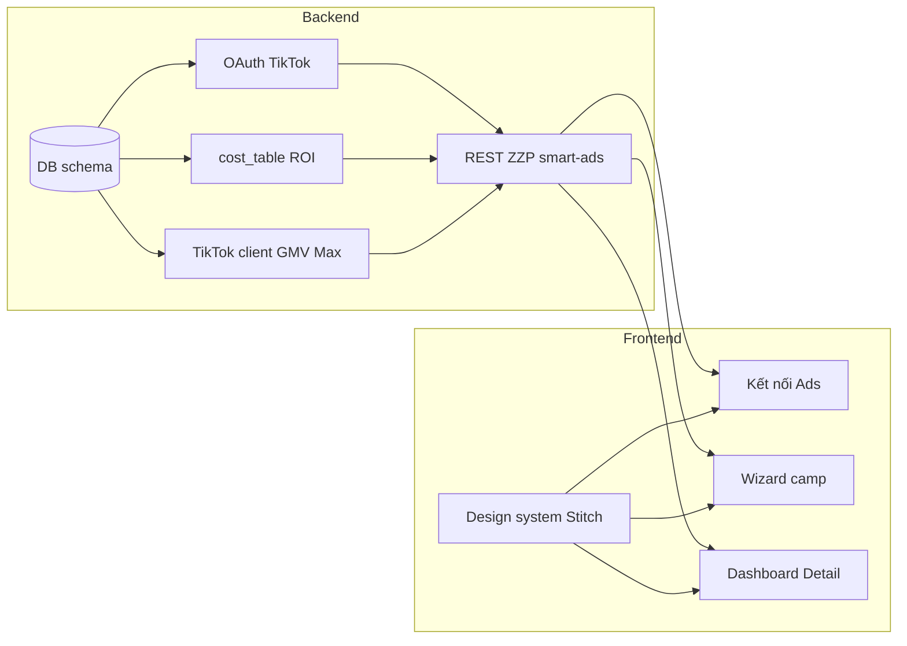

# Smart Ads — Phase 1 Backlog (BE / FE)

| Trường | Giá trị |
|--------|---------|
| **Phiên bản** | 1.3 |
| **Cập nhật** | 2026-06-11 |
| **Nguồn** | Kế hoạch chi tiết Smart Ads Phase 1 (TikTok Parity); đồng bộ với [PRD-SmartAds-v2.md](PRD-SmartAds-v2.md), [SRS-Campaign-Engine.md](SRS-Campaign-Engine.md), [API-tik-tok.md](API-tik-tok.md), UI [temp-ui/stitch_zzp_gmv_max_optimizer](../temp-ui/stitch_zzp_gmv_max_optimizer/). **ADR:** [docs/adr/README.md](adr/README.md). |

---

## 1. Phạm vi Phase 1

Theo [PRD-SmartAds-v2.md](PRD-SmartAds-v2.md) **Phase 1 — Nền tảng (TikTok Parity):** OAuth TikTok Ads, bảng chi phí + gợi ý ROI, tạo GMV Max (sản phẩm + video theo spec đã chốt), dashboard hiệu suất trong ZZP, ngân sách khởi tạo an toàn (**20% MDB** theo [SRS-Campaign-Engine.md](SRS-Campaign-Engine.md) — tạo camp).

**Quyết định / mặc định kỹ thuật (chi tiết trong ADR — PM có thể ký xác nhận hoặc sửa ADR):**

- **Payload tạo camp & ngân sách khởi tạo:** [ADR 0001 — TikTok create payload (SRS vs RunAllVideos)](adr/0001-smartads-phase1-tiktok-create-payload.md) — mặc định triển khai **SRS Phase 1**; RunAllVideos giữ cho lớp tối ưu Phase 2 trừ khi PM thống nhất gộp.
- **Camp seller TikTok (BR-2):** [ADR 0002 — External campaign mirror](adr/0002-smartads-external-campaign-mirror.md) — chỉ sync, không clone; guard write.
- **Notification Phase 1:** [ADR 0003 — Notification scope](adr/0003-smartads-phase1-notifications.md) — tối thiểu DB + in-app + worker stub/log; SMS/Zalo/Email prod theo Phase 1.5 + feature flag.

**Ngoài Phase 1 (Phase 2 PRD):** tối ưu tự động, Hero, chặn bùng đơn, tồn kho — chỉ stub hoặc future nếu UI cần hiển thị trạng thái. **Đối chiếu kỹ thuật P1 vs P2:** [SRS-Campaign-Engine.md — §0](SRS-Campaign-Engine.md) và bảng [§1.1](#p1-p2-srs-matrix) bên dưới.

### 1.1 Đối chiếu Phase 1 vs Phase 2 (đồng bộ SRS)

Nguồn chuẩn: [SRS-Campaign-Engine.md](SRS-Campaign-Engine.md) mục **§0 — Cách đọc tài liệu này**. Toàn bộ ID **P1-BE-\*** / **P1-FE-\*** trong file này là **phạm vi giao hàng Phase 1** (TikTok Parity), trừ khi một mục ghi rõ *tuỳ PM* / *stub*.

| Chủ đề | Phase 1 (bắt buộc / mặc định backlog này) | Phase 2+ (Optimization / bảo vệ / SAM pipeline) |
|--------|-------------------------------------------|--------------------------------------------------|
| OAuth, `cost_table`, `roi-suggestion`, proxy sản phẩm/video | Có — P1-BE-01…08, 15; P1-FE-02, 03, 08, 09 | Mở rộng scope/token nếu cần |
| Tạo camp GMV Max lần đầu (`create`), **20% MDB**, `roas_bid` = ROAS hòa vốn, tên `ZZP` | Có — P1-BE-09, 16–18; P1-FE-04, 05, 10 | Payload **RunAllVideos** / learning 72h Target ROI (không Max Delivery) — [SmartAds-RunAllVideos-Flow.md](SmartAds-RunAllVideos-Flow.md); [ADR 0001](adr/0001-smartads-phase1-tiktok-create-payload.md) |
| Đọc list/detail/report, sync TikTok → DB, guard `zzp_mutable`, mirror EXTERNAL | Có — P1-BE-10…14, 21; P1-FE-06, 07 | Optimization Engine đọc thêm tín hiệu — SRS §4.5 + PRD Phase 2 |
| State `INIT` → `WARMING` sau publish; `warming_ends_at`; nhãn 72h trên UI | Có — P1-BE-03, 09 | Chuyển `WARMING` → `STABLE` **theo logic Optimization**; nhánh `HERO` / `REVIVAL` — SRS §4.2 |
| `PATCH` camp ZZP + TikTok `gmv_max/update` | **Tuỳ PM** trong P1 — P1-BE-19 | Tối ưu hàng ngày C1–C5 — `SRS-Optimization-Rules` (PRD §3.1) |
| Tự động **ADD** video KOC từ SAM vào camp (`creative/update`) | Không nghiệm thu P1 (có thể hiển thị pool **read-only**) | SRS [§4.3 bước 3](SRS-Campaign-Engine.md) |
| Chặn bùng đơn, tồn kho real-time, Hero split, Holiday mode | Không | PRD §1.5 Phase 2; Protection / Optimization SRS |

---

## 2. Campaign do Seller tạo trên TikTok (BR-2)

**Nguyên tắc:** Chỉ **sync (mirror)** từ TikTok vào DB ZZP — **không** “clone” tạo camp mới trên TikTok cho camp seller.

- `ownership`: `ZZP_MANAGED` | `EXTERNAL_TIKTOK`; `zzp_mutable` = true chỉ với camp ZZP.
- Mọi `PUT/POST` write (update, status, creative) trả **403** nếu không phải `ZZP_MANAGED`.
- FE: badge **“Tạo trên TikTok — chỉ xem”**; có thể xem report read-only theo quyết định PM.

Chi tiết đầy đủ: [ADR 0002](adr/0002-smartads-external-campaign-mirror.md) và [PRD-SmartAds-v2.md](PRD-SmartAds-v2.md) BR-2.

---

## 3. Epic / Story / Task

- **Epic:** mảng giá trị lớn (Onboarding, Chiến dịch & báo cáo, …).
- **Story:** luồng nghiệm thu (vertical slice: BE + FE + tích hợp).
- **Task:** ticket dev (migration, client TikTok, component, …).

### 3.1 Gợi ý Story → task ID

| Story | Backend | Frontend |
|-------|---------|----------|
| **S1 — Kết nối TikTok Ads** | P1-BE-01, 04, 05, 15 | P1-FE-02, 08, 09 |
| **S2 — Chuẩn bị ROI + sản phẩm** | P1-BE-02, 06, 07, 20 | P1-FE-03 |
| **S3 — Nháp, publish & cấu hình ZZP** | P1-BE-03, 07, 08, 16, 17, 18, 09 (+ 19 nếu chỉnh camp trong P1) | P1-FE-03, 04, 05, 10 |
| **S4 — Hiệu suất + sync + guard** | P1-BE-10, 11, 12, 13, 14, 21 | P1-FE-06, 07 |
| **S5 — Thông báo seller** | P1-BE-22, 23 | P1-FE-11 |

Khi import Jira/Linear, thêm cột: **Story**, **Estimate**, **Owner**, **Sprint**.

---

## 4. Ánh xạ màn Stitch → journey

Thư mục: [temp-ui/stitch_zzp_gmv_max_optimizer](../temp-ui/stitch_zzp_gmv_max_optimizer) — design tokens: [DESIGN.md](../temp-ui/stitch_zzp_gmv_max_optimizer/emerald_data_system/DESIGN.md).

| Màn (Stitch) | Vai trò |
|--------------|---------|
| `c_u_h_nh_chi_n_d_ch_gmv_max_popup_xem_tr_c_hi_u_ng_h_n_ch` | Wizard: MDB, ROI, preview |
| `gmv_max_x_c_nh_n_l_i_s_d_l_u_nh_p` | Xác nhận số dư / nạp tiền TikTok (BR-1) |
| `gmv_max_x_c_nh_n_kh_i_t_o` | Xác nhận khởi tạo |
| `gmv_max_dashboard_qu_n_l_chi_n_d_ch_chi_ti_t` | Dashboard danh sách camp |
| `chi_ti_t_chi_n_d_ch_gmv_max_bi_u_c_t_danh_s_ch_s_n_ph_m` | Chi tiết camp, chart, SP |

API TikTok tổng hợp: [API-tik-tok.md](API-tik-tok.md).

---

## 5. Sơ đồ phụ thuộc (rút gọn)

---

## 6. Backlog — Backend (P1-BE-01 → P1-BE-23)

Mỗi mục: **ID**, **Title**, **Description**, **Acceptance**, **Phụ thuộc**. **Thứ tự số để tra cứu;** thứ tự triển khai theo **Phụ thuộc** (ví dụ **P1-BE-21** trước khi wire đầy đủ **P1-BE-12**). Cột enum `state` / `campaign_type` trong **P1-BE-03** phản ánh **schema + hiển thị** theo SRS; logic tự động chuyển `HERO` / tối ưu sau `WARMING` là **Phase 2** (xem [§1.1](#p1-p2-srs-matrix)).

**Tham chiếu nhanh (yêu cầu mở rộng 1–13 → ID):** (1) scope → **15**; (2) refresh hết hạn → **05**; (3) DB + sync + cờ ZZP → **03**, **13**; (4) config 1-1 → **16**; (5) API tạo + tiền + TikTok + idempotent + tên `ZZP` → **09**; (6) audit nội bộ → **17**; (7) nháp → **18**; (8) sửa camp ZZP → **19**; (9) eligibility “tất cả SP” → **20**; (10) list product proxy → **07**; (11) bảng lỗi TikTok → **21** + **12**; (12) notification → **22**; (13) lưu notification/seller → **23**.

- **P1-BE-01 — Database: oauth_tokens + migration**
  - **Description:** Bảng lưu kết nối TikTok Ads per seller: `seller_id`, `advertiser_id`, `access_token` và `refresh_token` **mã hóa** (AES-256), `expires_at` (hết hạn access), `refresh_exp_at` (hết hạn refresh), `status` enum `ACTIVE` | `EXPIRED` | `REVOKED`.
  - **Acceptance:** Migration chạy được; log/APM không chứa token plaintext.
  - **Phụ thuộc:** —

- **P1-BE-02 — Database: cost_table (+ shop/product FK nếu codebase có convention)**
  - **Description:** Một dòng / một `product_id` (TikTok Shop): `gia_ban` (P, VND), `cogs`, `phi_san_pct`, `phi_thanh_toan_pct`, `hoa_hong_koc_pct`, `phi_ship_seller`, `phi_dong_goi` — đồng bộ từ TikTok Shop (giá) + dịch vụ nội bộ ZZP (COGS, phí). **ROAS hòa vốn:** `CM = P - cogs - P*(phi_san_pct + phi_thanh_toan_pct + hoa_hong_koc_pct) - phi_ship_seller - phi_dong_goi`; `ROAS_be = P / CM` (khi CM &gt; 0).
  - **Acceptance:** Có dữ liệu tối thiểu để API `roi-suggestion` trả đúng `ROAS_be`.
  - **Phụ thuộc:** P1-BE-01 (không bắt buộc), có thể song song.

- **P1-BE-03 — Database: campaign_state**
  - **Description:** `id` (uuid ZZP), `seller_id`, `advertiser_id`, **`tiktok_campaign_id` nullable** (null = nháp), `state` `INIT` | `WARMING` | `STABLE` | `HERO` | `PAUSED`, `campaign_type` `MAIN` | `HERO` | `REVIVAL`, `parent_campaign_id`, `roi_target`, `daily_budget`, `max_daily_budget` (MDB), `activated_at`, `warming_ends_at` (= `activated_at` + 72h), `last_optimized_at`, `last_optimized_date`, `paused_at`, `paused_reason`, `ownership` (`ZZP_MANAGED` | `EXTERNAL_TIKTOK`), `zzp_mutable`, `last_synced_at`, tùy chọn `raw_payload` JSON. **Đồng bộ định kỳ:** job (vd. 15–60 phút + khi mở dashboard); TikTok là source of truth cho mirror; cấu hình “smart” qua **P1-BE-16**.
  - **Acceptance:** Unique `(advertiser_id, tiktok_campaign_id)` khi `tiktok_campaign_id` không null; `EXTERNAL_TIKTOK` → `zzp_mutable=false`; nháp ZZP: `tiktok_campaign_id` null + `ownership=ZZP_MANAGED`.
  - **Phụ thuộc:** P1-BE-01.

- **P1-BE-04 — OAuth TikTok: connect URL + callback exchange**
  - **Description:** `GET /api/v1/smart-ads/oauth/connect?seller_id=…` → URL TikTok portal auth với **đủ scope** (advertiser, campaign, GMV Max report, onsite store, audience nếu cần). `GET …/oauth/callback`: verify `state`, exchange `code`, lưu token mã hóa, lấy `advertiser_id`.
  - **Acceptance:** Sau callback: token DB, `status=ACTIVE`, CSRF qua `state`.
  - **Phụ thuộc:** P1-BE-01.

- **P1-BE-05 — OAuth: status + disconnect + refresh (flow hết hạn)**
  - **Description:** `GET …/oauth/status`, `DELETE …/disconnect`. Job refresh trước khi access hết hạn ~**5 phút**. **401** → refresh **một lần** → retry; fail → `EXPIRED` + banner kết nối lại. `refresh_token` hết hạn → OAuth lại.
  - **Acceptance:** Disconnect vô hiệu token; có test/script refresh + retry.
  - **Phụ thuộc:** P1-BE-04.

- **P1-BE-06 — Internal API: cost-table + roi-suggestion**
  - **Description:** `GET /api/v1/smart-ads/cost-table?shop_id=…`, `GET …/cost-table/{product_id}`, `GET …/roi-suggestion?product_id=…` → `roas_breakeven`, `cm_per_order`, `suggested_roi_target`.
  - **Acceptance:** Đủ field cho FE wizard; `ROAS_be` khớp công thức + fixture.
  - **Phụ thuộc:** P1-BE-02.

- **P1-BE-07 — TikTok client: store products (proxy)**
  - **Description:** `GET /store/product/get/` → `GET /api/v1/smart-ads/products`. BE chỉ chuẩn hóa response, không tự lọc business ngoài contract TikTok.
  - **Acceptance:** 429 backoff; retry 3 lần 1s / 5s / 15s; lỗi persist **P1-BE-21** khi áp dụng.
  - **Phụ thuộc:** P1-BE-05.

- **P1-BE-08 — TikTok client: GMV Max videos**
  - **Description:** `GET /gmv_max/video/get/` → `GET /smart-ads/videos` nếu cần.
  - **Acceptance:** Danh sách video cho advertiser đã OAuth; retry/backoff đồng bộ client TikTok.
  - **Phụ thuộc:** P1-BE-05.

- **P1-BE-09 — API tạo Smart Ads (publish TikTok, idempotent)**
  - **Description:** `POST /api/v1/smart-ads/campaigns` (+ `idempotency-key`). Pipeline: (1) OAuth + **P1-BE-15** scope; (2) **balance/billing** TikTok hoặc soft-check nếu PM chốt; (3) `POST /campaign/gmv_max/create/` — budget **20%** MDB, `roas_bid` = **ROAS_be**, `campaign_name` bắt đầu **`ZZP`**; (4) lưu `campaign_state` + **P1-BE-16** + audit **P1-BE-17**.
  - **Acceptance:** Đúng budget/ROAS/tên; không duplicate khi retry.
  - **Phụ thuộc:** P1-BE-03, 05, 06, 15, 16, 17.

- **P1-BE-10 — Đọc campaign: list + detail + status**
  - **Description:** Merge TikTok GET + `campaign_state`; `POST …/status` chỉ `ZZP_MANAGED`.
  - **Acceptance:** List ZZP + EXTERNAL; mutation EXTERNAL → **403**.
  - **Phụ thuộc:** P1-BE-09, P1-BE-13.

- **P1-BE-11 — Báo cáo GMV Max**
  - **Description:** `GET /gmv_max/report/get/` → `GET /smart-ads/reports` (dimensions: `campaign_id`, `stat_time_day`, …). Metrics: `gross_revenue`, `cost`, `roi`, `orders`.
  - **Acceptance:** Đủ dữ liệu chart/bảng chi tiết.
  - **Phụ thuộc:** P1-BE-10.

- **P1-BE-12 — Log lỗi TikTok + health**
  - **Description:** Structured log, không token; 429 backoff; retry 3 bước; persist lỗi vào **P1-BE-21**.
  - **Acceptance:** Trace id; có đường ghi DB cho vận hành.
  - **Phụ thuộc:** P1-BE-21 (schema trước hoặc cùng lúc).

- **P1-BE-13 — Sync campaign từ TikTok**
  - **Description:** Job + `POST …/campaigns/sync` + sau OAuth: `GET /gmv_max/campaign/get/`, upsert `campaign_state`; phân loại ZZP vs EXTERNAL; không tạo `smart_ads_campaign_config` cho EXTERNAL.
  - **Acceptance:** `last_synced_at`; không TikTok write cho EXTERNAL.
  - **Phụ thuộc:** P1-BE-03, P1-BE-05.

- **P1-BE-14 — Guard mutation**
  - **Description:** Mọi write assert `zzp_mutable`; audit attempt sửa EXTERNAL.
  - **Acceptance:** Test: không write path cho EXTERNAL.
  - **Phụ thuộc:** P1-BE-13.

- **P1-BE-15 — Kiểm tra OAuth scope**
  - **Description:** Sau OAuth hoặc `GET …/oauth/scopes`; lưu `granted_scopes`, `scope_ok`, `scope_checked_at`.
  - **Acceptance:** Thiếu scope quan trọng → chặn publish (409/403 + code).
  - **Phụ thuộc:** P1-BE-04.

- **P1-BE-16 — Bảng `smart_ads_campaign_config` (1-1 ZZP)**
  - **Description:** FK unique `zzp_campaign_id` → `campaign_state.id`; MDB, `product_selection_mode`, `product_ids` JSON, `video_selection_mode`, metadata wizard. Không row cho EXTERNAL.
  - **Acceptance:** 0–1 config / camp ZZP publish; không orphan.
  - **Phụ thuộc:** P1-BE-03.

- **P1-BE-17 — `campaign_internal_audit_log`**
  - **Description:** Append-only: `actor`, `action`, `payload` JSON, `created_at`.
  - **Acceptance:** Mỗi publish/update config có audit; index theo `zzp_campaign_id` + time.
  - **Phụ thuộc:** P1-BE-03.

- **P1-BE-18 — API draft campaign**
  - **Description:** `POST/PATCH /api/v1/smart-ads/campaigns/drafts`; publish qua P1-BE-09 + `draft_id`.
  - **Acceptance:** Resume wizard; một lần publish = một camp TikTok.
  - **Phụ thuộc:** P1-BE-03, 16, 17.

- **P1-BE-19 — API sửa camp ZZP**
  - **Description:** `PATCH /api/v1/smart-ads/campaigns/{zzp_campaign_id}` + TikTok `gmv_max/update` + audit.
  - **Acceptance:** EXTERNAL → 403.
  - **Phụ thuộc:** P1-BE-14, 16, 17, 05.

- **P1-BE-20 — API product-selection eligibility**
  - **Description:** `GET …/product-selection-eligibility` → `{ all_products_equivalent: bool }`.
  - **Acceptance:** Case catalog ≠ all SP → `false`.
  - **Phụ thuộc:** P1-BE-07, 16.

- **P1-BE-21 — Bảng `tiktok_api_errors`**
  - **Description:** `http_status`, `tiktok_request_id`, endpoint, `seller_id`, `trace_id`, … không secrets.
  - **Acceptance:** Query theo seller/ngày.
  - **Phụ thuộc:** P1-BE-01.

- **P1-BE-22 — Notification worker (SMS / Zalo OA / Email)**
  - **Description:** Đọc outbox / `seller_notifications` `QUEUED`; template + kênh; provider hoặc stub Phase 1.
  - **Acceptance:** E2E tối thiểu + retry + `FAILED` observable.
  - **Phụ thuộc:** P1-BE-23.

- **P1-BE-23 — `seller_notifications` + API**
  - **Description:** Bảng + `GET /api/v1/smart-ads/notifications`, `PATCH …/read`; `event_id` idempotency.
  - **Acceptance:** Lịch sử trong app.
  - **Phụ thuộc:** — (migration trước P1-BE-22).

---

## 7. Backlog — Frontend (P1-FE-01 → P1-FE-11)

- **P1-FE-01 — Design system (Stitch / Emerald)** — [DESIGN.md](../temp-ui/stitch_zzp_gmv_max_optimizer/emerald_data_system/DESIGN.md). **Phụ thuộc:** —

- **P1-FE-02 — Hub kết nối TikTok** — `oauth/connect`, callback flow, `oauth/status`. **Phụ thuộc:** P1-BE-04, 05.

- **P1-FE-03 — Wizard thiết lập camp** — MDB, ROI, preview; gọi P1-BE-20 để ẩn “tất cả SP” khi không equivalent. **Phụ thuộc:** P1-BE-06, 20, P1-FE-01.

- **P1-FE-04 — Xác nhận số dư / BR-1** — Link nạp TikTok, không thu hộ. **Phụ thuộc:** P1-FE-03.

- **P1-FE-05 — Xác nhận khởi tạo** — `POST /api/v1/smart-ads/campaigns` hoặc publish từ `draft_id`. **Phụ thuộc:** P1-BE-09, P1-FE-04.

- **P1-FE-06 — Dashboard danh sách camp** — Badge ZZP vs TikTok; sync on-mount (P1-BE-13). **Phụ thuộc:** P1-BE-10, P1-FE-01.

- **P1-FE-07 — Chi tiết camp** — Chart, reports; read-only EXTERNAL; form edit ZZP nếu PM bật P1-BE-19. **Phụ thuộc:** P1-BE-11, P1-FE-06.

- **P1-FE-08 — Disconnect + error states** — **Phụ thuộc:** P1-BE-05, P1-FE-02.

- **P1-FE-09 — Banner thiếu scope** — P1-BE-15. **Phụ thuộc:** P1-BE-15, P1-FE-02.

- **P1-FE-10 — Auto-save draft** — P1-BE-18. **Phụ thuộc:** P1-BE-18, P1-FE-03.

- **P1-FE-11 — Trung tâm thông báo in-app** — P1-BE-23. **Phụ thuộc:** P1-BE-23, P1-FE-01.

---

## 8. Bảng tóm tắt import (đầy đủ — Description / Acceptance / Phụ thuộc)

Dùng copy vào spreadsheet / Jira CSV / Linear. **Story** theo mục 3.1. **Description**, **Acceptance**, **Phụ thuộc** đồng bộ với backlog trong plan dự án (`.cursor/plans/smartads_p1_fe_be_tasks_35dfa2f9.plan.md`) và phạm vi **Phase 1** theo [SRS-Campaign-Engine §0–§4.3](SRS-Campaign-Engine.md). **Phase 2+** không import qua bảng này — xem PRD Phase 2 + RunAllVideos. Trong Markdown, ô dài dùng ` `; export CSV bọc field có dấu phẩy trong ngoặc kép.

| ID | Loại | Title (ngắn) | Story | Description | Acceptance | Phụ thuộc | Owner | Sprint | Estimate |
|----|------|---------------|-------|-------------|------------|------------|-------|--------|----------|
| P1-BE-01 | BE | Database: oauth_tokens + migration | S1 | Bảng lưu kết nối TikTok Ads per seller: `seller_id`, `advertiser_id`, `access_token` và `refresh_token` **mã hóa** (AES-256), `expires_at` (hết hạn access), `refresh_exp_at` (hết hạn refresh), `status` enum `ACTIVE` / `EXPIRED` / `REVOKED`. | Migration chạy được; log/APM không chứa token plaintext. | — | | | |
| P1-BE-02 | BE | Database: cost_table + ROI inputs | S2 | Một dòng / một `product_id` (TikTok Shop): `gia_ban` (P, VND), `cogs`, `phi_san_pct`, `phi_thanh_toan_pct`, `hoa_hong_koc_pct`, `phi_ship_seller`, `phi_dong_goi` — đồng bộ từ TikTok Shop (giá) + dịch vụ nội bộ ZZP (COGS, phí). Dùng để tính **ROAS hòa vốn**: `CM = P - cogs - P*(phi_san_pct + phi_thanh_toan_pct + hoa_hong_koc_pct) - phi_ship_seller - phi_dong_goi`; `ROAS_be = P / CM` (khi CM > 0). | Có dữ liệu tối thiểu để API `roi-suggestion` trả đúng `ROAS_be` với ví dụ kiểm chứng trong tài liệu dự án. | P1-BE-01 (không bắt buộc), có thể song song | | | |
| P1-BE-03 | BE | Database: campaign_state (+ sync fields) | S3 | Bảng trạng thái chiến dịch ZZP/TikTok: `id` (uuid id nội bộ ZZP), `seller_id`, `advertiser_id`, **`tiktok_campaign_id` nullable** (null = nháp chưa publish lên TikTok), `state` enum `INIT` / `WARMING` / `STABLE` / `HERO` / `PAUSED`, `campaign_type` `MAIN` / `HERO` / `REVIVAL`, `parent_campaign_id` (nullable), `roi_target`, `daily_budget`, `max_daily_budget` (MDB), `activated_at`, `warming_ends_at` (= `activated_at` + 72h), `last_optimized_at`, `last_optimized_date`, `paused_at`, `paused_reason`. **Thêm:** `ownership` (`ZZP_MANAGED` / `EXTERNAL_TIKTOK`), `zzp_mutable` (boolean), `last_synced_at`, tùy chọn `raw_payload` JSON. **Đồng bộ định kỳ:** job (vd. mỗi 15–60 phút + sau mỗi lần seller mở dashboard) gọi TikTok list/get, upsert: TikTok là source of truth cho trường mirror; ZZP chỉ ghi đè các cột “smart” qua bảng config (P1-BE-16). | Một seller có N camp; unique `(advertiser_id, tiktok_campaign_id)` **khi `tiktok_campaign_id` không null**; mọi dòng `EXTERNAL_TIKTOK` có `zzp_mutable=false`; nháp ZZP có `tiktok_campaign_id` null + `ownership=ZZP_MANAGED`. | P1-BE-01 | | | |
| P1-BE-04 | BE | OAuth TikTok: connect URL + callback | S1 | `GET /api/v1/smart-ads/oauth/connect?seller_id=…` trả URL TikTok `https://business-api.tiktok.com/portal/auth?app_id=…&redirect_uri=…&state=…` với **đủ scope** Smart Ads cần (tối thiểu theo tài liệu dự án: quản lý advertiser, campaign, báo cáo GMV Max, onsite commerce store, audience nếu Phase sau dùng). `GET …/oauth/callback?code=…&state=…`: verify `state`, exchange `code` → access + refresh token, gọi TikTok lấy `advertiser_id` + tên tài khoản, lưu DB mã hóa. | Luồng đầy cuối: sau callback có token trong DB, `status=ACTIVE`, `advertiser_id` khớp TikTok; CSRF qua `state`. | P1-BE-01 | | | |
| P1-BE-05 | BE | OAuth: status, disconnect, refresh + 401 retry | S1 | `GET /api/v1/smart-ads/oauth/status?seller_id=…` → `{ connected, advertiser_id, account_name, expires_at }`. `DELETE …/oauth/disconnect` → xóa token / vô hiệu hóa. **Refresh chủ động:** job (hoặc scheduler) refresh access token trước khi hết hạn ~**5 phút**. **Refresh thụ động / khi seller “hết hạn”:** mọi client TikTok gặp **401** do token hết hạn → thử refresh **một lần** rồi retry request; refresh fail → `status=EXPIRED`, trả lỗi rõ cho FE (banner “kết nối lại TikTok”). **Lưu ý:** refresh_token cũng có thể hết hạn — khi đó bắt buộc OAuth lại. | Disconnect xóa quyền dùng API; token hết hạn xử lý đúng nhánh `EXPIRED`; có ít nhất một integration test hoặc script chứng minh refresh + retry. | P1-BE-04 | | | |
| P1-BE-06 | BE | API: cost-table + roi-suggestion | S2 | `GET /api/v1/smart-ads/cost-table?shop_id=…` (danh sách), `GET …/cost-table/{product_id}` (chi tiết), `GET …/roi-suggestion?product_id=…` → `{ product_id, roas_breakeven, cm_per_order, suggested_roi_target }` (công thức ROAS_be/CM như task P1-BE-02). | Response có đủ field để FE wizard hiển thị gợi ý; giá trị `ROAS_be` khớp công thức với fixture test. | P1-BE-02 | | | |
| P1-BE-07 | BE | TikTok proxy: list products | S2 | Gọi TikTok `GET /store/product/get/` → expose nội bộ `GET /api/v1/smart-ads/products` (phân trang/filter theo contract TikTok). BE **không** tự biến đổi danh sách sản phẩm ngoài map field chuẩn hóa response. | Xử lý rate limit HTTP **429** (exponential backoff); lỗi mạng/5xx: retry tối đa **3** lần, backoff **1s → 5s → 15s**, sau đó log + alert nội bộ; lỗi từ TikTok ghi vào bảng task P1-BE-21 khi áp dụng. | P1-BE-05 | | | |
| P1-BE-08 | BE | TikTok client: GMV Max videos | S3 | Gọi TikTok `GET /gmv_max/video/get/`; nếu UI cần pool: `GET /smart-ads/videos`. | Trả danh sách video khả dụng cho advertiser đã OAuth; cùng chính sách retry/backoff như client TikTok chung. | P1-BE-05 | | | |
| P1-BE-09 | BE | API publish campaign (TikTok create, idempotent) | S3 | `POST /api/v1/smart-ads/campaigns` (hoặc `…/campaigns/publish` nếu tách với nháp) nhận body: MDB, cấu hình sản phẩm/video (theo Phase 1 đã chốt), `idempotency-key` header (hoặc body). **Thứ tự xử lý gợi ý:** (1) Kiểm tra OAuth **ACTIVE** + **scope đủ** (P1-BE-15). (2) **Kiểm tra số dư / khả năng chi tiêu** tài khoản quảng cáo: gọi đúng **TikTok Advertiser/Billing API** mà app được phép; nếu API không khả dụng trong P1 thì **soft-check**: cảnh báo + cho tạo nhưng log rủi ro — cần PM chốt. (3) Gọi TikTok `POST /campaign/gmv_max/create/` với `budget` = **20%** MDB, `roas_bid` = **ROAS_be**, `budget_mode=BUDGET_MODE_DAY`, `promotion_type=PRODUCT_SALE`, nguồn SP/video theo spec; **`campaign_name` luôn bắt đầu bằng `ZZP`**. (4) Lưu `campaign_state`: gán `tiktok_campaign_id`, `state=WARMING`, `activated_at`, `warming_ends_at=+72h`, `ownership=ZZP_MANAGED`, `zzp_mutable=true`. (5) Upsert **một dòng** `smart_ads_campaign_config` (P1-BE-16). (6) Ghi **audit log** (P1-BE-17). | Ngân sách ngày trên TikTok = 20% MDB; `roas_bid` = ROAS_be; tên camp bắt đầu `ZZP`; retry/idempotency **không** tạo duplicate (unique theo seller + `idempotency-key` và/hoặc kiểm tra đã có `tiktok_campaign_id` cho cùng bản ghi publish). | P1-BE-03, P1-BE-05, P1-BE-06, P1-BE-15, P1-BE-16, P1-BE-17 | | | |
| P1-BE-10 | BE | API list/detail/status campaigns | S4 | Proxy TikTok `GET` list/info; merge `campaign_state` trả `ownership`, `zzp_mutable`. `POST …/campaigns/{id}/status` (pause/resume/delete) **chỉ** khi `ZZP_MANAGED` (BR-2 PRD). | List gồm camp ZZP + camp seller đã sync; detail đúng cờ; mọi mutation trên `EXTERNAL_TIKTOK` → **403**. | P1-BE-09, P1-BE-13 | | | |
| P1-BE-11 | BE | API reports GMV Max | S4 | Gọi TikTok `GET /gmv_max/report/get/` → nội bộ `GET /smart-ads/reports` với dimensions (vd. `campaign_id`, `stat_time_day`, `item_group_id`, `item_id`…). Metrics cho dashboard: **`gross_revenue`** (GMV), **`cost`**, **`roi`** (= gross_revenue/cost, blended TikTok), **`orders`**, có thể suy `cost/orders`. | FE có đủ chuỗi thời gian + tổng để vẽ chart/bảng như màn chi tiết. | P1-BE-10 | | | |
| P1-BE-12 | BE | Log lỗi TikTok + health + persist → P1-BE-21 | S4 | Log có cấu trúc (stdout/APM), không token; metric/alert khi hết retry. Client TikTok: backoff **429**, retry **3** lần **1s / 5s / 15s**. **Bổ sung:** mọi lỗi TikTok đủ điều kiện (HTTP code, `request_id` TikTok nếu có, endpoint, `seller_id`/`advertiser_id`) **persist** sang bảng **P1-BE-21** để vận hành ZZP tra cứu tập trung. | Mỗi request có trace id; throttle/5xx quan sát được; ít nhất một đường ghi DB lỗi TikTok cho team nội bộ. | P1-BE-21 (cùng triển khai hoặc P1-BE-21 trước schema) | | | |
| P1-BE-13 | BE | Job + API sync campaigns từ TikTok | S4 | Job định kỳ + `POST …/campaigns/sync` (on-demand) + chạy sau OAuth lần đầu: `GET /gmv_max/campaign/get/` (+ `campaign/gmv_max/info/` khi cần), **upsert** `campaign_state` theo `tiktok_campaign_id`. **Phân loại:** `ZZP_MANAGED` nếu id khớp bản ghi ZZP đã tạo **hoặc** `campaign_name` bắt đầu `ZZP`; ngược lại `EXTERNAL_TIKTOK`, `zzp_mutable=false`, **không** tạo dòng `smart_ads_campaign_config`. Đồng bộ ghi `last_synced_at`; có thể lưu diff nhỏ vào audit nếu cần (tuỳ PM). | DB phản ánh trạng thái TikTok sau mỗi lần sync; không TikTok **write** cho `EXTERNAL_TIKTOK`. | P1-BE-03, P1-BE-05 | | | |
| P1-BE-14 | BE | Guard mutation (zzp_mutable) | S4 | Lớp kiểm tra tập trung: mọi update camp, creative, status đều `assert zzp_mutable`; log audit khi có attempt sửa EXTERNAL. | Test tự động: không có write path nào cho `EXTERNAL_TIKTOK`. | P1-BE-13 | | | |
| P1-BE-15 | BE | Kiểm tra OAuth scope seller | S1 | Sau OAuth (hoặc endpoint `GET …/oauth/scopes?seller_id=…`): gọi TikTok **introspect / advertiser / permission** theo doc app (hoặc thử một **probe read** tối thiểu: list campaign + store product + report) để xác nhận đủ scope. Lưu DB: `granted_scopes` (JSON/text), `scope_ok` (bool), `scope_checked_at`. FE hiển thị “Thiếu quyền X — vào TikTok kết nối lại”. | Nếu thiếu scope quan trọng → chặn **publish** camp (409/403 có message code); không chặn read-only sync tùy chính sách PM. | P1-BE-04 | | | |
| P1-BE-16 | BE | Bảng smart_ads_campaign_config (1-1 ZZP) | S3 | Bảng cấu hình **chỉ** cho chiến dịch do ZZP quản lý: `zzp_campaign_id` FK unique → `campaign_state.id`. Cột gợi ý: MDB seller nhập, `product_selection_mode` (ALL vs CUSTOM), danh sách `product_ids` (JSON), `video_selection_mode`, metadata wizard, `created_at`/`updated_at`. **Camp `EXTERNAL_TIKTOK` không có dòng** trong bảng này. | Mỗi camp ZZP publish có đúng 0–1 dòng config; không orphan sau xóa camp (FK + soft delete hoặc cascade theo chính sách). | P1-BE-03 | | | |
| P1-BE-17 | BE | Bảng campaign_internal_audit_log | S3 | Bảng append-only `campaign_internal_audit_log`: `id`, `zzp_campaign_id`, `actor` (system / seller_id / admin), `action` (vd. `DRAFT_CREATED`, `PUBLISHED`, `CONFIG_UPDATED`, `BUDGET_SET`, `ROI_SET`, `SYNCED_FROM_TIKTOK`, `PAUSE_REQUESTED`), `payload` JSON (snapshot tham số: chi phí, ROI, budget, khung giờ nếu có), `created_at`. Dùng cho vận hành + debug + compliance nội bộ. | Mỗi publish/update config ZZP có ít nhất một dòng audit; có index theo `zzp_campaign_id` + thời gian. | P1-BE-03 | | | |
| P1-BE-18 | BE | API draft campaign | S3 | `POST/PATCH /api/v1/smart-ads/campaigns/drafts`: tạo/cập nhật bản ghi `campaign_state` với `tiktok_campaign_id=null`, `ownership=ZZP_MANAGED`, trạng thái nháp (vd. `state=INIT` + flag `is_draft=true` hoặc enum riêng). Lưu/ghi `smart_ads_campaign_config` (P1-BE-16) gắn `zzp_campaign_id`. **Publish** gọi P1-BE-09 truyền `draft_id`. | Seller có thể thoát wizard và quay lại; publish một lần tạo đúng một camp TikTok. | P1-BE-03, P1-BE-16, P1-BE-17 | | | |
| P1-BE-19 | BE | API PATCH campaign ZZP (+ TikTok update) | S3 | `PATCH /api/v1/smart-ads/campaigns/{zzp_campaign_id}` (chỉ `ZZP_MANAGED` + `zzp_mutable`): cập nhật config nội bộ + gọi TikTok `POST /campaign/gmv_max/update/` (budget, roas_bid, …) theo field được phép Phase 1. Ghi audit (P1-BE-17). Không cho sửa draft của người khác / sai `seller_id`. | EXTERNAL → 403; mọi thay đổi có audit + có thể có idempotency key. | P1-BE-14, P1-BE-16, P1-BE-17, P1-BE-05 | | | |
| P1-BE-20 | BE | API product-selection eligibility | S2 | `GET /api/v1/smart-ads/campaigns/{zzp_campaign_id}/product-selection-eligibility` (hoặc query trên draft config): so sánh tập `product_ids` trong config với **full list** từ TikTok (P1-BE-07) theo cùng rule filter (chỉ SP active…). Trả `{ all_products_equivalent: bool }`. Nếu `false` → FE **không** hiển thị/không gửi được chế độ “chọn tất cả” (CUSTOMIZED only). | Test với shop có SP bị ẩn/khác catalog → `all_products_equivalent=false`. | P1-BE-07, P1-BE-16 | | | |
| P1-BE-21 | BE | Bảng tiktok_api_errors | S4 | Bảng `tiktok_api_errors` (hoặc tên tương đương): `id`, `created_at`, `seller_id`, `advertiser_id`, `http_status`, `tiktok_request_id`, `tiktok_endpoint`, `error_code`, `error_message` (truncated), `trace_id`, `resolved_at` nullable. Ghi từ wrapper TikTok (sau khi hết retry hoặc ngay lần đầu nếu 4xx nghiêm trọng — PM chốt). | Có truy vấn theo seller/ngày; không chứa token/request body nhạy cảm. | P1-BE-01 | | | |
| P1-BE-22 | BE | Notification worker (SMS / Zalo / Email) | S5 | Worker đọc **outbox** / hàng đợi (có thể chính là các dòng `seller_notifications` trạng thái `QUEUED` trong P1-BE-23), gửi theo **template + kênh** (SMS, Zalo OA, Email). Tích hợp provider thật **hoặc** Phase 1 chỉ **interface + log + in-app** nếu chưa có hợp đồng — chốt trong ADR 0003. | Một luồng E2E tối thiểu (vd. email dev hoặc in-app only) + retry + trạng thái `FAILED` có thể xem lại. | P1-BE-23 (schema + ghi dòng QUEUED trước khi gửi) | | | |
| P1-BE-23 | BE | seller_notifications + API list/read | S5 | Bảng `seller_notifications`: `id`, `seller_id`, `channel`, `type`, `title`, `body`, `payload` JSON, `status` (QUEUED/SENT/FAILED/READ), `sent_at`, `read_at`, tùy chọn `event_id` (idempotency). API `GET /api/v1/smart-ads/notifications` (phân trang), `PATCH …/notifications/{id}/read`. Producer: OAuth hết hạn, publish fail, (tuỳ chọn) cảnh báo từ P1-BE-21 khi cần user-facing. | Seller xem được lịch sử trong app; không trùng gửi khi retry nếu dùng `event_id`. | — (migration độc lập; triển khai trước P1-BE-22) | | | |
| P1-FE-01 | FE | Design system Stitch / Emerald | S1 | Áp dụng màu/typography/spacing từ [DESIGN.md](../temp-ui/stitch_zzp_gmv_max_optimizer/emerald_data_system/DESIGN.md) vào theme app (Tailwind/CSS vars/shadcn — theo stack repo). | Các màn P1 dùng chung token; font Hanken Grotesk + JetBrains Mono cho số liệu. | — | | | |
| P1-FE-02 | FE | Hub Smart Ads + kết nối TikTok | S1 | Màn hub: hiển thị connected/disconnected; nút gọi `GET .../oauth/connect` mở URL TikTok; xử lý return từ ZZP sau callback (poll `oauth/status` hoặc redirect kèm flag). | Seller thấy “Đã kết nối” + tên account khi BE trả về. | P1-BE-04, P1-BE-05 | | | |
| P1-FE-03 | FE | Wizard thiết lập chiến dịch | S2, S3 | Port UI từ `c_u_h_nh_chi_n_d_ch_gmv_max_popup...`: nhập MDB, hiển thị Budget_initial (theo rule đã chốt), slider/input ROI tối thiểu, preview hiệu năng nếu có mock/API. Gọi **P1-BE-20** để ẩn tùy chọn “tất cả sản phẩm” khi không tương đương full catalog TikTok. | Gọi `roi-suggestion` theo sản phẩm/shop; validation client theo rule tối thiểu ROI nếu PRD/PM đã chốt (hiển thị lỗi rõ ràng). | P1-BE-06, P1-BE-20, P1-FE-01 | | | |
| P1-FE-04 | FE | Bước xác nhận số dư / BR-1 | S3 | Port `gmv_max_x_c_nh_n_l_i_s_d_l_u_nh_p`: copy BR-1, link nạp tiền TikTok, không thu hộ. | Không gọi API nạp tiền; chỉ hướng dẫn. | P1-FE-03 | | | |
| P1-FE-05 | FE | Xác nhận khởi tạo / publish | S3 | Port `gmv_max_x_c_nh_n_kh_i_t_o`: tóm tắt cấu hình; nút “Bắt đầu chạy” → `POST /api/v1/smart-ads/campaigns` (hoặc publish từ `draft_id`). Auto-save nháp qua P1-BE-18 nếu PM yêu cầu. | Loading, error từ BE/TikTok hiển thị rõ; success redirect tới dashboard/detail. | P1-BE-09, P1-FE-04 | | | |
| P1-FE-06 | FE | Dashboard danh sách chiến dịch | S4 | Port `gmv_max_dashboard_qu_n_l_chi_n_d_ch_chi_ti_t`: bảng camp, chip trạng thái (map `campaign_state.state` + TikTok status). **Cột/badge** phân biệt ZZP vs TikTok seller; actions chỉnh sửa chỉ hiện khi `zzp_mutable`. Có thể gọi sync on-mount (P1-BE-13) để dữ liệu mới. | `GET /api/v1/smart-ads/campaigns` hiển thị cả hai loại; EXTERNAL không có nút sửa/pause qua ZZP. | P1-BE-10, P1-FE-01 | | | |
| P1-FE-07 | FE | Chi tiết chiến dịch + chart | S4 | Port `chi_ti_t_chi_n_d_ch_gmv_max...`: chart theo ngày; bảng SP; chỉ số GMV/cost/ROI/orders từ reports. **Read-only** cho EXTERNAL (copy hướng dẫn “Chỉnh trên TikTok Ads Manager”). Với ZZP-managed: form chỉnh (hoặc deep link) gọi P1-BE-19 khi PM bật chỉnh từ ZZP trong P1. | `GET .../reports` + `.../campaigns/{id}`; filter date range; không render form edit khi `!zzp_mutable`. | P1-BE-11, P1-FE-06 | | | |
| P1-FE-08 | FE | Disconnect + empty/error states | S1 | Disconnect; banner token hết hạn; 401/403 handling. | Gọi `DELETE .../disconnect`; clear UI state. | P1-BE-05, P1-FE-02 | | | |
| P1-FE-09 | FE | Banner thiếu OAuth scope | S1 | Hiển thị kết quả P1-BE-15 (`scope_ok`, danh sách thiếu); CTA “Kết nối lại TikTok” mở `oauth/connect`. | Khi `scope_ok=false`, chặn nút publish / “Bắt đầu chạy” với message rõ. | P1-BE-15, P1-FE-02 | | | |
| P1-FE-10 | FE | Auto-save draft wizard | S3 | Debounce gọi `POST/PATCH …/campaigns/drafts`; hiển thị “Đã lưu nháp”; resume khi vào lại Smart Ads. | Refresh trang không mất cấu hình; publish một lần không duplicate. | P1-BE-18, P1-FE-03 | | | |
| P1-FE-11 | FE | Trung tâm thông báo in-app | S5 | List + đánh dấu đã đọc từ `GET …/notifications`; tuỳ Phase có deep-link tới camp / OAuth. | Phân trang; ít nhất một loại sự kiện (vd. token sắp hết hoặc publish fail) hiển thị được. | P1-BE-23, P1-FE-01 | | | |

*(Điền Owner / Sprint / Estimate khi planning sprint. Nguồn Description/Acceptance/Phụ thuộc: plan `.cursor/plans/smartads_p1_fe_be_tasks_35dfa2f9.plan.md`; **ranh giới Phase 1 vs Phase 2** theo [SRS-Campaign-Engine §0](SRS-Campaign-Engine.md) và [§1.1](#p1-p2-srs-matrix) trong file này.)*

---

*Tài liệu này là bản làm việc trong repo; cập nhật khi PRD/SRS hoặc payload TikTok được chốt.*
