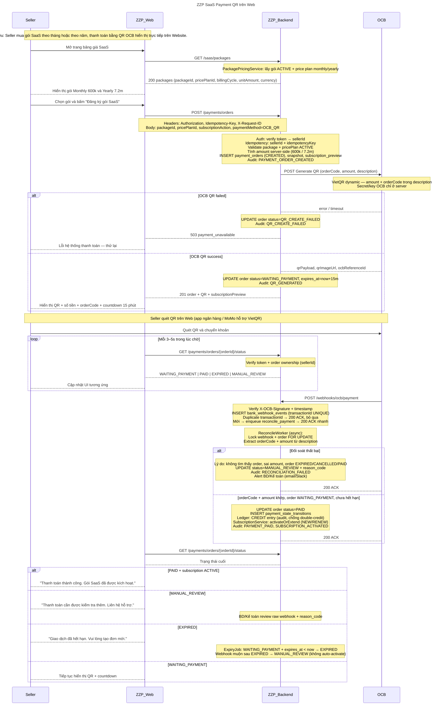

## Ánh xạ module (chi tiết triển khai)

Diagram trên dùng **4 actor** ở tầng hệ thống. Khi triển khai, `ZZP_Backend` tách thành các module sau:

| Module | Trách nhiệm |
| --- | --- |
| PaymentAPI | REST: danh sách gói, đơn hàng, trạng thái |
| AuthService | Xác thực Bearer token → sellerContext |
| PackagePricingService | Kiểm tra gói + price plan ACTIVE |
| PaymentService | Tạo đơn, idempotency, gọi OCB gen QR |
| WebhookAPI | Nhận webhook OCB, verify chữ ký |
| Queue + ReconcileWorker | Đối soát async: khớp orderCode + amount |
| LedgerService | Ghi CREDIT bất biến, chống cộng tiền 2 lần |
| SubscriptionService | activateOrExtend sau PAID |
| PaymentDB | payment_orders, bank_webhook_events, snapshots, ledger, subscriptions |
| AuditLog | Sự kiện PAYMENT_ORDER_CREATED, QR_GENERATED, PAYMENT_PAID, … |
| ExpiryJob | Cron: WAITING_PAYMENT quá 15p → EXPIRED |

## Bề mặt API

| Method | Path | Mục đích |
| --- | --- | --- |
| GET | `/saas/packages` | Danh sách gói SaaS + price plan |
| POST | `/payments/orders` | Tạo đơn + gen QR OCB |
| GET | `/payments/orders/{orderId}/status` | Poll trạng thái cho Web |
| POST | `/webhooks/ocb/payment` | Nhận biến động số dư từ OCB |

## Trạng thái đơn hàng

`CREATED` → `WAITING_PAYMENT` → `PAID` | `EXPIRED` | `CANCELLED` | `MANUAL_REVIEW` | `QR_CREATE_FAILED`
