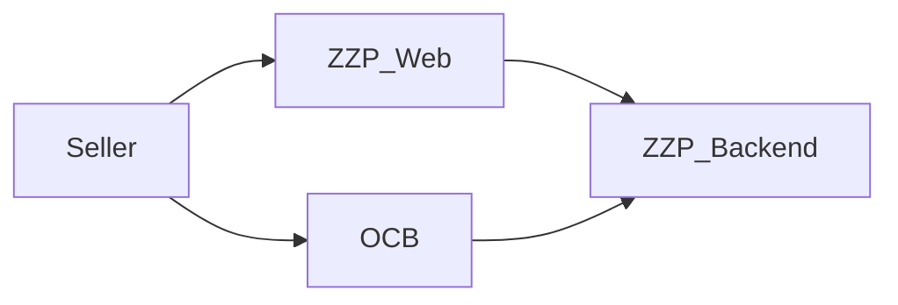
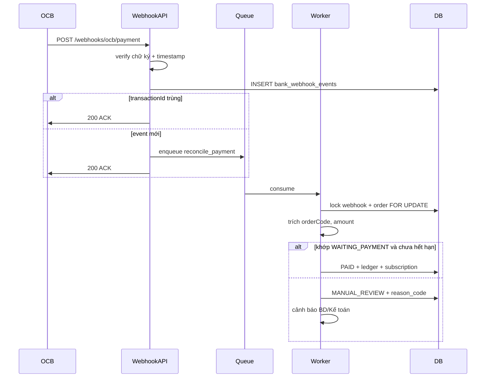
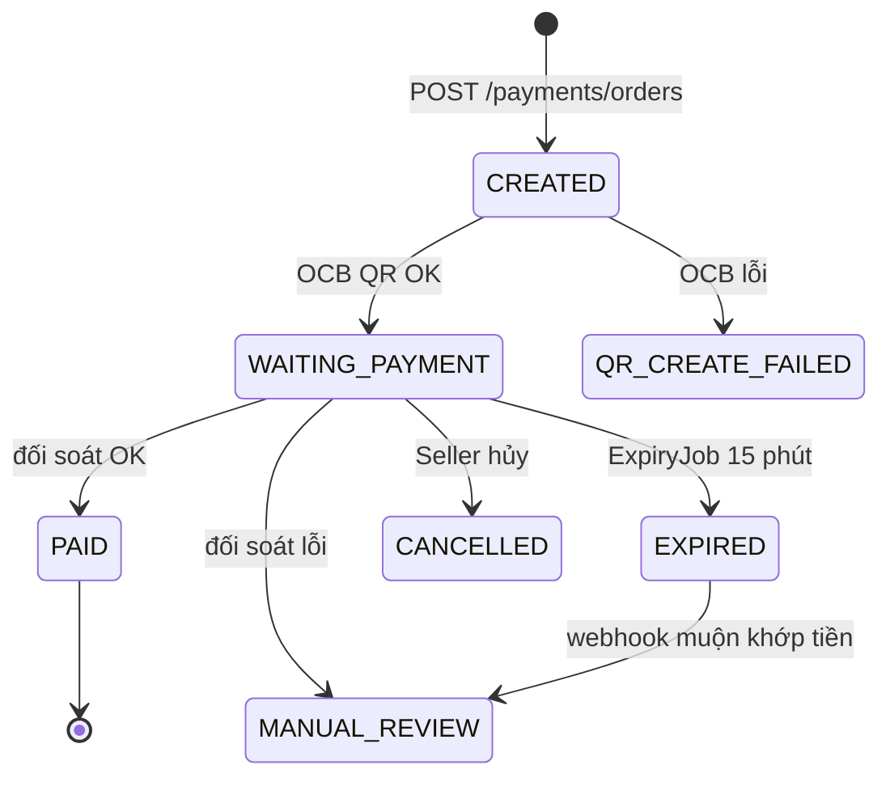
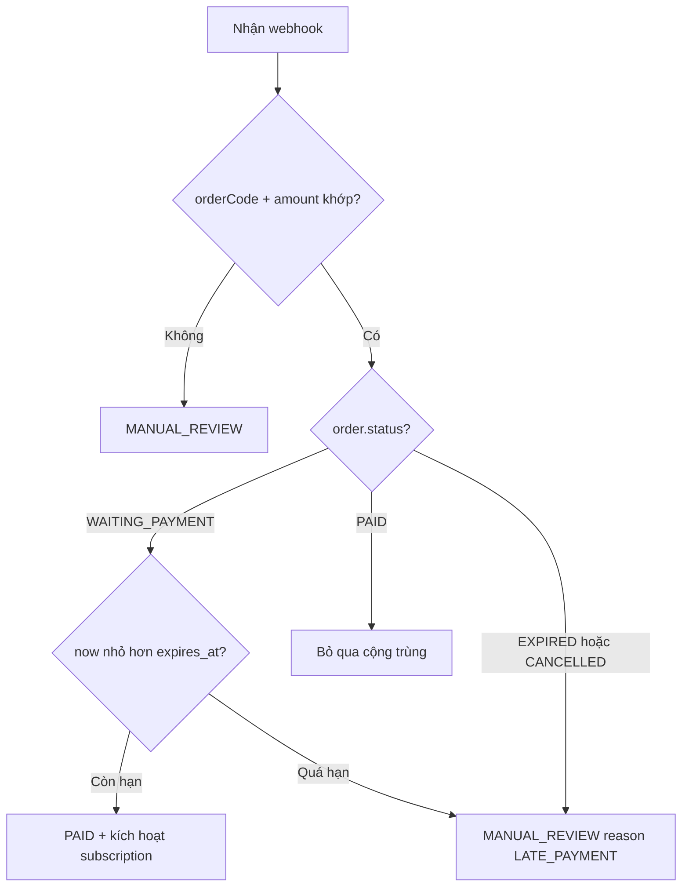

# Thiết kế — Thanh toán & Đối soát (OCB QR SaaS)

| Thuộc tính | Giá trị |
| ---------- | ------- |
| **Trạng thái** | Đã duyệt — sẵn sàng lập kế hoạch triển khai |
| **Owner** | @tuan.vo |
| **Ngày tạo** | 2026-06-23 |
| **PRD** | [thanhtoan.md](../../../thanhtoan.md) v2 |
| **Sơ đồ luồng** | [payment-flow.md](../../../payment-flow.md) |
| **Checklist spike** | [2026-06-23-ocb-integration-spike.md](./2026-06-23-ocb-integration-spike.md) |

---

## 1. Tóm tắt

Phase 1 của ZZP thu phí đăng ký/gia hạn gói SaaS qua **OCB VietQR dynamic** hiển thị trên Website. Sau khi Seller chuyển khoản, OCB gửi webhook; ZZP **đối soát bất đồng bộ** theo `orderCode` + `amount`, rồi kích hoạt hoặc gia hạn subscription SaaS.

**Ngoài phạm vi phase 1:** Zalo ZNS, nạp ví, đa ngân hàng, hoàn tiền, admin dashboard đầy đủ.

---

## 2. Quyết định đã chốt

| # | Quyết định | Lựa chọn | Lý do |
| - | ---------- | -------- | ----- |
| D1 | Use case | Đăng ký/gia hạn gói SaaS (tháng/năm) | Đã xác nhận với PM |
| D2 | Kênh QR | Chỉ QR OCB trên Website | Không tích hợp Zalo |
| D3 | Mô hình đối soát | **Worker bất đồng bộ** (Luồng 2) | ACK webhook nhanh, scale tốt, audit trail đầy đủ |
| D4 | Chính sách thanh toán trễ | **Phương án A — MANUAL_REVIEW** | An toàn nhất; không auto-kích hoạt sau `EXPIRED` |
| D5 | Quyền hết hạn | **BE là nguồn sự thật** (`expires_at` trên `payment_orders`) | Hoạt động kể cả khi OCB QR không có TTL tùy chỉnh |
| D6 | Actor trên diagram | 4 actor hệ thống | Seller, ZZP_Web, ZZP_Backend, OCB |
| D7 | Khóa khớp | `orderCode` + `amount` (số nguyên VND chính xác) | BR-1, BR-2 từ PRD |
| D8 | Idempotency | `sellerId + idempotencyKey` (tạo đơn); `transactionId` UNIQUE (webhook) | Chống đơn trùng / cộng tiền 2 lần |

---

## 3. Kiến trúc

### 3.1 Ngữ cảnh hệ thống (4 actor)



| Actor | Trách nhiệm |
| ----- | ----------- |
| **Seller** | Chọn gói, quét QR, thanh toán |
| **ZZP_Web** | Trang bảng giá, hiển thị QR, countdown, polling trạng thái |
| **ZZP_Backend** | Đơn hàng, OCB client, webhook, queue, đối soát, ledger, subscription, job hết hạn |
| **OCB** | Gen VietQR, nhận chuyển khoản, gửi webhook biến động số dư |

Module nội bộ (trong ZZP_Backend): PaymentAPI, AuthService, PackagePricingService, PaymentService, WebhookAPI, Queue, ReconcileWorker, LedgerService, SubscriptionService, ExpiryJob, AuditLog — xem [payment-flow.md](../../../payment-flow.md).

### 3.2 Luồng đối soát (bất đồng bộ)



**Vì sao không đối soát đồng bộ trong webhook handler:** lock DB lâu, lỗi subscription có thể khiến OCB retry, khó scale khi nhiều webhook đồng thời.

### 3.3 State machine đơn hàng



### 3.4 Thanh toán trễ & hết hạn (D4, D5)



- **ExpiryJob** (cron ~1 phút): `WAITING_PAYMENT` VÀ `expires_at < now()` → `EXPIRED`
- Webhook đến sau `EXPIRED` mà vẫn khớp khóa → `MANUAL_REVIEW` (`reason_code: LATE_PAYMENT`), **không** auto-kích hoạt
- BD/Kế toán duyệt thủ công và kích hoạt subscription ở phase 2 (admin UI); phase 1 = cảnh báo + xử lý thủ công

---

## 4. Hợp đồng API

| Method | Path | Auth | Mục đích |
| ------ | ---- | ---- | -------- |
| GET | `/saas/packages` | Bearer | Danh sách gói SaaS + price plan đang ACTIVE |
| POST | `/payments/orders` | Bearer + `Idempotency-Key` | Tạo đơn, gen QR OCB |
| GET | `/payments/orders/{orderId}/status` | Bearer | Poll trạng thái cho Web |
| POST | `/webhooks/ocb/payment` | Chữ ký OCB | Nhận thông báo có tiền vào |

### POST `/payments/orders` (request)

```json
{
  "packageId": "uuid",
  "pricePlanId": "uuid",
  "subscriptionAction": "NEW | RENEW",
  "targetSubscriptionId": "uuid | null",
  "paymentMethod": "OCB_QR",
  "clientReference": "string | null"
}
```

### POST `/payments/orders` (response 201)

```json
{
  "orderId": "uuid",
  "orderCode": "ZZP-20260623-ABC123",
  "status": "WAITING_PAYMENT",
  "amount": 600000,
  "currency": "VND",
  "expiresAt": "2026-06-23T10:15:00Z",
  "package": { "id": "...", "name": "..." },
  "pricePlan": { "id": "...", "billingCycle": "monthly" },
  "subscriptionPreview": { "action": "NEW", "periodEndPreview": "..." },
  "qr": { "payload": "...", "imageUrl": "...", "ocbReferenceId": "..." }
}
```

### Header webhook (dự kiến)

- `X-OCB-Signature` — HMAC trên raw body (xác nhận qua spike OCB)
- `X-OCB-Timestamp` — chống replay
- `X-OCB-Request-ID` — correlation

### Giá trị `reason_code` khi đối soát

| Mã | Ý nghĩa |
| -- | ------- |
| `ORDER_NOT_FOUND` | Không tìm thấy `payment_orders` theo orderCode |
| `AMOUNT_MISMATCH` | Số tiền webhook ≠ order.amount |
| `ORDER_NOT_WAITING` | Đơn đã PAID/CANCELLED/... |
| `ORDER_EXPIRED` | Quá `expires_at` khi vẫn WAITING_PAYMENT |
| `LATE_PAYMENT` | Khớp khóa nhưng đơn đã EXPIRED |
| `INVALID_DESCRIPTION` | Không parse được orderCode từ webhook |
| `DUPLICATE_TRANSACTION` | Xử lý ở bước ingest; worker không thấy |

---

## 5. Mô hình dữ liệu

### `payment_orders`

| Cột | Kiểu | Ghi chú |
| --- | ---- | ------- |
| id | UUID PK | |
| seller_id | UUID | Từ token |
| package_id | UUID | |
| price_plan_id | UUID | |
| order_code | VARCHAR UNIQUE | Nhúng trong description QR |
| amount | BIGINT | VND integer, tính ở server |
| currency | CHAR(3) | `VND` |
| status | ENUM | Xem state machine |
| expires_at | TIMESTAMPTZ | `now() + 15 phút` |
| paid_at | TIMESTAMPTZ | nullable |
| paid_amount | BIGINT | nullable |
| bank_transaction_id | VARCHAR | nullable |
| matched_webhook_event_id | UUID FK | nullable |
| qr_payload | TEXT | nullable |
| qr_image_url | TEXT | nullable |
| ocb_reference_id | VARCHAR | nullable |
| idempotency_key | VARCHAR | UNIQUE theo seller_id |
| created_at | TIMESTAMPTZ | |

### `payment_order_snapshots`

Snapshot giá bất biến tại thời điểm mua (`package_name`, `billingCycle`, `durationMonths`, `unitAmount`, `finalAmount`, `pricingVersion`).

### `subscription_preview`

`action` (NEW/RENEW), `periodStartPreview`, `periodEndPreview` — hiển thị trên UI checkout.

### `bank_webhook_events`

| Cột | Kiểu | Ghi chú |
| --- | ---- | ------- |
| id | UUID PK | |
| provider | VARCHAR | `OCB` |
| transaction_id | VARCHAR UNIQUE | Khóa chống trùng |
| amount | BIGINT | |
| currency | CHAR(3) | |
| description | TEXT | Chứa orderCode |
| raw_payload | JSONB | Toàn bộ webhook |
| signature_valid | BOOLEAN | |
| status | ENUM | RECEIVED, PROCESSED, FAILED |
| received_at | TIMESTAMPTZ | |

### `payment_state_transitions`

`payment_order_id`, `from_status`, `to_status`, `reason_code`, `created_at` — nhật ký chuyển trạng thái.

### `payment_ledger`

Bất biến: `seller_id`, `payment_order_id`, `webhook_event_id`, `entry_type` (CREDIT), `amount`, `source` (`OCB_QR_PAYMENT`), `created_at`. Phase 1 chỉ SaaS — không cập nhật số dư ví (fulfillment là subscription).

### `seller_subscriptions` + `subscription_events`

Kích hoạt/gia hạn bởi SubscriptionService sau PAID.

---

## 6. Quy tắc nghiệp vụ (từ PRD)

| ID | Quy tắc |
| -- | ------- |
| BR-1 | QR chứa đúng số tiền + orderCode duy nhất |
| BR-2 | Subscription chỉ kích hoạt khi webhook khớp (orderCode + amount) |
| BR-3 | sellerId chỉ lấy từ token |
| BR-4 | Không tạo QR nếu gói không hợp lệ hoặc OCB lỗi |

---

## 7. Hành vi Frontend

1. **Trang bảng giá** — `GET /saas/packages`
2. **Checkout** — `POST /payments/orders` với `Idempotency-Key` mới mỗi phiên bấm
3. **Màn QR** — hiển thị ảnh QR, số tiền, orderCode, countdown 15 phút
4. **Polling** — `GET /payments/orders/{id}/status` mỗi 3–5s đến trạng thái kết thúc
5. **UI trạng thái cuối**
   - `PAID` → thông báo thành công + subscription active
   - `EXPIRED` → gợi ý tạo đơn mới
   - `MANUAL_REVIEW` → liên hệ hỗ trợ
   - `QR_CREATE_FAILED` / 503 → nút thử lại

---

## 8. Bảo mật & độ tin cậy

| Rủi ro | Giảm thiểu |
| ------ | ---------- |
| Webhook giả mạo | Verify chữ ký trên raw body trước khi parse |
| Replay webhook | Cửa sổ timestamp + `transaction_id` UNIQUE |
| Cộng tiền 2 lần | Lock DB + chuyển PAID idempotent + ledger |
| Lộ đơn sang Seller khác | Endpoint status kiểm tra `sellerId` sở hữu `orderId` |
| Sửa amount từ client | Amount chỉ tính ở server |
| Lộ secret OCB | Credential OCB chỉ trên server |

---

## 9. Quan sát hệ thống (Observability)

Sự kiện audit: `PAYMENT_ORDER_CREATED`, `QR_GENERATED`, `QR_CREATE_FAILED`, `DUPLICATE_WEBHOOK_IGNORED`, `RECONCILIATION_FAILED`, `PAYMENT_PAID`, `SUBSCRIPTION_ACTIVATED_OR_EXTENDED`.

Cảnh báo BD/Kế toán khi `MANUAL_REVIEW` kèm `reason_code`, `order_code`, `transaction_id`, link raw webhook.

---

## 10. Rủi ro & hạng mục mở (spike OCB)

| Rủi ro | Giảm thiểu | Spike # |
| ------ | ---------- | ------- |
| MoMo quét được QR không | Test UAT quét thử | 2 |
| Thanh toán sau QR hết hạn | BE MANUAL_REVIEW (D4) | 6 |
| Webhook muộn thiếu orderCode | Luồng orphan → MANUAL_REVIEW | 6 |
| Không có API hủy QR | State machine BE bỏ qua đơn không WAITING | 7 |
| Webhook không tới | Phase 2: poll API check-transaction | 10 |

Hoàn thành spike trước khi dùng credential production: [2026-06-23-ocb-integration-spike.md](./2026-06-23-ocb-integration-spike.md).

---

## 11. Ranh giới phase

| Phase 1 (spec này) | Phase 2+ |
| ------------------ | -------- |
| Checkout SaaS QR OCB | Admin UI MANUAL_REVIEW |
| Đối soát async + subscription | Job đối soát định kỳ |
| ExpiryJob + cảnh báo MANUAL_REVIEW | Nạp ví |
| Polling Web | Gửi QR qua Zalo/SMS |

---

## 12. Tài liệu tham khảo

- [thanhtoan.md](../../../thanhtoan.md) — PRD v2
- [payment-flow.md](../../../payment-flow.md) — sơ đồ sequence
- VietQR dynamic: hiệu lực 15 phút (chuẩn NAPAS/VietQR)
